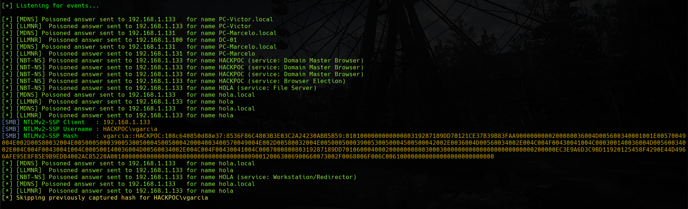
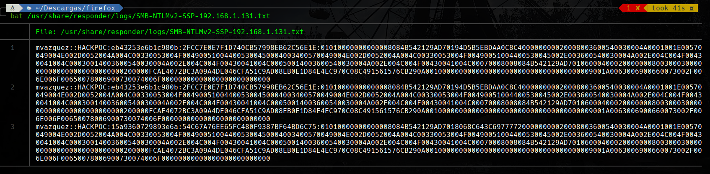
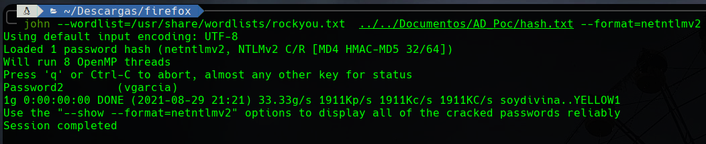
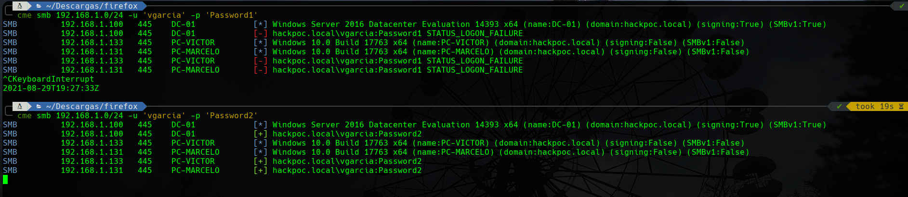
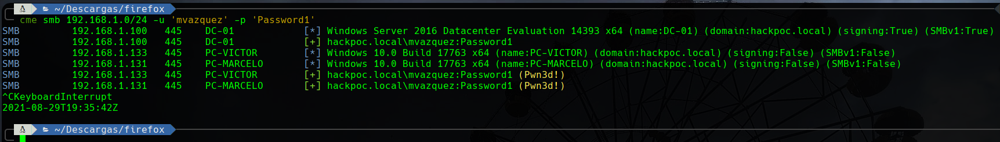
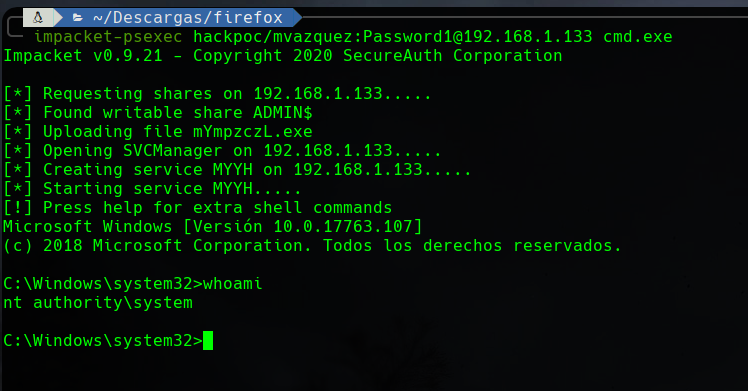
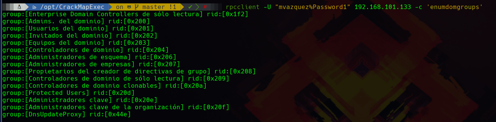
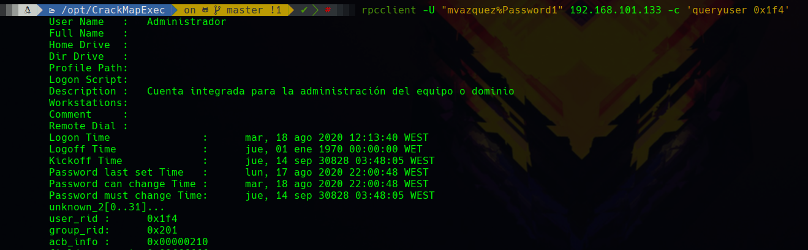
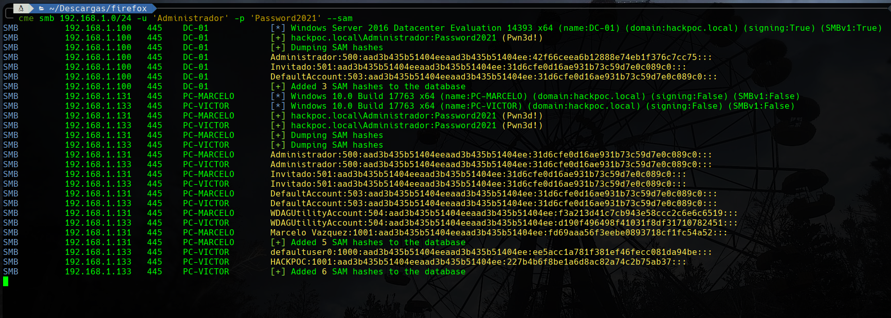

# SMB RELAY

## INTRODUCCIÓN


Este ataque está relacionado a las [malas prácticas](https://ajcruz15.gitbook.io/red-team/active-directory-hacking/creando-un-laboratorio-de-ad/3.-misconfiguraciones-importantes):

* **1. Generar recurso compartido SMB**
* **2. Desactivar el Firewall de Windows**
* **3. Desactivar las protecciones del Antivirus de Windows Defender**
* **4. Crear usuario Administrador con Password Temporal**
* **7. Convertir un usuario en Administrador local de los clientes**


### Esquema de trabajo

Vamos a explotar el siguiente esquema:

En los entornos empresariales existen actividades programadas que comprueban los recursos compartidos para ver si siguen existiendo. Esto hace que en muchas ocasiones, un equipo \(normalmente con un administrador local detrás\) se trate de conectar a muchos recursos compartidos que no existen a lo largo del día. Teniendo esto en cuenta, este ataque consiste en lo siguiente:

1. El equipo víctima le preguntará al DC, ‘Oye, me dejas conectarme a \archivos?’ 
2. El DC le responderá, ‘pues no tengo ni idea de lo que me estás hablando’ 
3. El equipo víctima preguntará por tanto a nivel de red, '¿alguno sabe cómo me puedo conectar a \archivos?' 
4. El equipo del atacante responderá y le dirá ‘Yo, envíame tu Hash y te conectaré al recurso’ 
5. El equipo víctima responderá ‘Okey, pues ahí te envío mi Hash’

### Herramientas necesarias

#### Responder

Es un envenenador de tráfico que se puede aplicar a una gran variedad de protocolos.



#### CrackMapExec

Es una herramienta de post-explotación que se aprovecha de protocolos y características propias de los entornos de Directorio Activo para obtener una gran cantidad de información sobre los mismos.

Utiliza **Impacket** y **Powersploit Toolkit**



#### **Impacket**

Es una colección de clases de Python para trabajar con protocolos de red. Está pensada para obtener control a bajo nivel de los paquetes utilizados por algunos protocolos y, en algunos casos como SMBv1, la propia implementación del protocolo en sí mismo.



#### PowerSploit Toolkit

Es una colección de scripts de Powershell orientados a ayudar a pentesters en su proceso. Éste repositorio se encuentra deprecated.



#### John the Ripper

Es un crackeador de Hashes que se caracteríza por su velocidad y versatilidad.



#### RPCClient

Herramienta para ejecutar el cliente de MS-RPC. Viene instalada por defecto en Linux.



#### PTH-WinExe

Una aplicación que forma parte de la suite PTH-Toolkit y que permite ejecutar comandos en Windows realizando la técnica de PassTheHash.



### Resumen

* Vamos a utilizar responder para envenenar paquetes smb y así obtener el hash NetNTLM-v2.
* Este Hash lo vamos a crackear con john.
* Comprobaremos con CrackMapExec sí esta contraseña es correcta
* Entenderemos por qué o por qué no tenemos capacidad de obtener una shell interactiva.
* Utilizaremos Impacket-psexec para obtener una shell interactiva.
* Aprovecharemos las ventajas que nos brinda este acceso.

## EXPLOIT

### 1. Envenenar paquetes SMB

El repeater se encuentra configurado por defecto para envenenar paquetes SMB, por lo tanto, vamos a comprobar que el archivo de configuración del repeater está por defecto \(Todo ON\):

```text
head -n 20 /usr/share/responder/Responder.conf

[Responder Core]

; Servers to start
SQL = On
SMB = On
RDP = On
Kerberos = On
FTP = On
POP = On
SMTP = On
IMAP = On
HTTP = On
HTTPS = On
DNS = On
LDAP = On
DCERPC = On
WINRM = On

; Custom challenge. 
; Use "Random" for generating a random challenge for each requests (Default)
```

Hemos comprobado que sí, por lo tanto, lanzamos el responder con el siguiente comando:

`sudo responder -I eth0 -rdw`


Con el responder activo, la victima tratará de abrir un recurso compartido que no existe y el responder envenenará esta solicitud:




### 2. Crackear el Hash

É​ste Hash que hemos recuperado no sirve para la tecnica PassTheHash pero si para crackearlo y obtener acceso.

En el directorio `/usr/share/responder/logs` encontramos unos logs con la forma `SMB-NTLMv2-SSP-$IP.txt` donde se almacenan todos los Hashes NetNTLM-v2 capturados.



Copiamos este fichero asegurándonos de que solo contenga un hash de cada victima y se los pasamos a **john** para que los crackee.

`john --wordlist=/usr/share/wordlists/rockyou.txt /RUTA_A/hash.txt --format=netntlmv2`



### 3. Comprobar la contraseña

Utilizando CrackMapExec podemos averiguar si esta password es correcta y si podemos obtener una shell interactiva. Para ello utilizamos el siguiente comando:

`cme smb IP_VICTIMA -u USUARIO -P PASSWORD`



Como podemos ver en la captura anterior, Password1 no es la contraseña \(Pone \[-\] al lado de los intentos de logon\) mientras que Password2 si que lo es \(\[+\] a los intentos de logon\).

### 4. Entender por qué no tenemos capacidad de Shell Remota

Pero... No vemos nada de capacidad de obtener una shell con **PSexec**. Esto se debe a que, como hemos visto cuando implementabamos las [malas prácticas](https://ajcruz15.gitbook.io/red-team/active-directory-hacking/creando-un-laboratorio-de-ad/3.-misconfiguraciones-importantes#7-convertir-un-usuario-en-administrador-local-de-los-clientes) en nuestro servidor, el usuario **vgarcia** no es administrador de su dispositivo y por lo tanto no tiene capacidad de shell remota por defecto como ocurre con los administradores locales.

Vamos a intentarlo en este caso con el usuario **mvazquez** que hemos dicho que sí que es **administrador** **local** de la red \(administrador en los clientes pero no en el servidor\).

Tras realizar el proceso anterior hemos descubierto que la password de **mvazquez** es **Password1.**



Como vemos, mvazquez, al pertenecer al grupo administradores, si que tiene capacidad de Shell Remota sobre los equipos de la red.

### 5. Obtener una shell interactiva

Ya sabemos que con este usuario podemos obtener una shell interactiva así que vamos a utilizar una utilidad de Impacket que se llama PSExec para obtener nuestra shell full interactiva.

`impacket-psexec DOMINIO/USUARIO:PASSWORD@IP cmd.exe`




Si el equipo víctima tiene la Protección en tiempo real de Windows Defender activa, este ataque no se puede realizar. Por eso es tan importante tener un buen antivirus en ambientes empresariales.


Ya tenemos una shell interactiva en un activo de la empresa desde el que poder realizar movimiento lateral al DC.

### 6. Post-Exploiting

Por otra parte, si hemos conseguido las credenciales del Administrador de Dominio es lógico que tendremos acceso al DC así como a todos los equipos de la red.

#### Obtener información con RPCClient

Una vez tenemos unos credenciales válidos, podemos utilizar RPCClient para obtener los nombres de usuario y la información de los mismos así como información de los grupos.


Esta parte está sacada exactamente del ejemplo de S4vitar en el siguiente [video](https://www.youtube.com/watch?v=LLevcaB4qew&list=PLlb2ZjHtNkpg2Mc3mbkdYAhEoqnMGdl2Z&index=2).


Utilizamos el comando rpcclient para obtener información sobre




A mi me interesa saber quienes forman parte del grupo Admins. del Dominio \(rid 0x200\) pues lo intentamos:


Hay dos usuarios en el grupo Admins del Dominio. Podemos ver los detalles de cada uno de ellos a ver si tenemos suerte.





Como habiamos generado un usuario administrador del dominio con contraseña temporal, hemos conseguido obtener esta contraseña utilizando RPCClient para ver los datos de los usuarios que pertenecen al grupo que nos interesa.

Esto no es habitual pero tampoco es extraño encontrar un usuario con bajos privilegios y la contraseña temporal escrita en la Descripción.


Utilizando estos nuevos credenciales, vemos que efectivamente hemos comprometido a un Administrador de dominio


#### Dumpear la SAM

Ahora que tenemos los credenciales del Administrador de Dominio y si quisieramos convertir éste ataque en un ataque de PassTheHash o quisieramos obtener credenciales para el resto de los usuarios de la red, podemos hacerlo con **CME dumpeando la SAM**.



#### Dumpear NTDS

De la misma manera podemos dumpear el NTDS \(La base de datos del Directorio Activo\) donde encontraremos el historial de contraseñas de todos los usuarios de AD.


#### PassTheHash

Por último podemos utilizar PTH-Winexe para utilizar estos Hashes para acceder al equipo:


## REFERENCIAS

[https://en.hackndo.com/pass-the-hash/\#protocol-ntlm](https://en.hackndo.com/pass-the-hash/#protocol-ntlm)  
[https://ethicalhackingguru.com/the-complete-ntlm-relay-attack-tutorial/](https://ethicalhackingguru.com/the-complete-ntlm-relay-attack-tutorial/)

