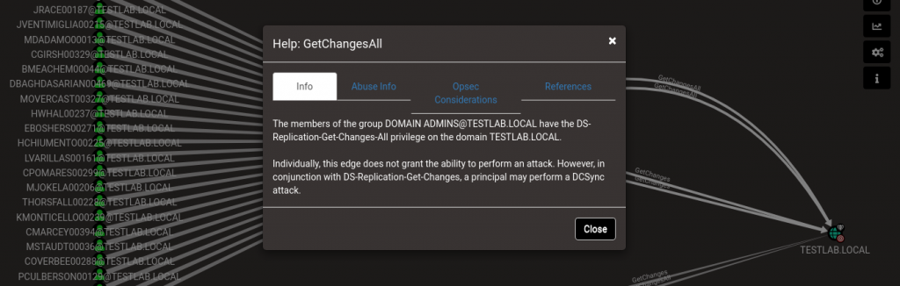

# BLOODHOUND


Este artículo es una traducción del articulo de datacell sobre Bloodhound.




En este artículo nos centraremos en entender en profundidad la herramienta **BloodHound**. Empezaremos con qué es y llegaremos a discutir que ataques potenciales se pueden realizar con Bloodhound pasando tambien por como instalarlo y como configurarlo.

## QUE ES BLOODHOUND <a id="cec3"></a>

**BloodHound** es una aplicación web basada en **JavaScript** y compilada con Electron. Utiliza **Neo4j** como base de datos \(backend\). **BloodHound** utiliza gráficos para mapear un **entorno de Directorio Activo** y, de esta manera, ayuda  a identificar varios vectores de ataque para **movimiento lateral** y **escalada de privilegios**. 


Los datos son suministrados utilizando recolectores de datos \(en ingles Ingestors\) que se conocen como **SharpHound**. Estos **SharpHound Ingestors** vienen en dos formas: script de Powershell y binario .NET precompilado. Además existen recolectores de datos desarrollados en python para poder ejecutar los ataques desde linux. 


Bloodhound puede ser utilizado tanto por Red Team como por Blue Team. Los atacantes lo utilizan para mapear el dominio e identificar posibles vectores de ataque y, de manera similar, los defensores lo pueden utilizar para descubrir fallas de seguridad y paliarlas.

Desarrollado por Andrew Robbins\([@\_waldo](https://twitter.com/_wald0)\) y Rohan Vazarkar \([@CptJesus](https://twitter.com/CptJesus)\), BloodHound tiene soporte para Windows, Linux y MacOS.

## INSTALLACIÓN Y CONFIGURACIÓN: <a id="109e"></a>

### **Linux:** <a id="7127"></a>

En distribuciones centradas en la seguridad como **Kali Linux** o **Parrot OS**, **BloodHound** puede ser installado desde el gestor de paquetes **apt**.

```text
$ sudo apt-get install bloodhound
```

Despues de instala **BloodHound**, debemos configurar **Neo4j** para ser utilizada con **BloodHound**. Esto equivale a cambiar la contraseña de la base de datos por defecto. Para hacerlo seguimos el siguiente proceso:

* Inicie Neo4j utilizando el siguiente comando:

```text
$ sudo neo4j console
```

* Tras el proceso de inicialización de **Neo4j** verá una **URL** donde se ejecuta la interfaz de **Neo4j** \(puerto **7474** por defecto\). Si visitamos `localhost:7474` en el explorador y nos autenticamos con los credenciales por defecto \(**neo4j:neo4j**\), podremos cambiar la contraseña por defecto.
* Finalmente ejecute **Bloodhound** desde la terminal e introduzca los credenciales de **neo4j**. Ya tenemos Bloodhound instalado y configurado.

## MAPEADO DEL DOMINIO, ENUMERACIÓN E IDENTIFICACIÓN DE VECTORES DE ATAQUE

### **Ingestors:** <a id="f18e"></a>

El primer paso es conseguir los datos y suministrarselos a la aplicación. La recolección de estos datos se realiza con lo SharpHound Ingestors que como ya hemos visto se encuentran disponibles en múltiples formatos \(Powershell Script, ejecutable .NET o python script\). Estos Ingestors tienen muchas opciones de recolección para enumerar unicamente aquello que nos interesa.

Algunas de estas opciones son:

* **Default:** Incluye miembros del AD security group, relaciones de confianza del dominio, permisos potencialmente explotables en objetos del AD, Unidades organizativas, estructura del arbol, Politicas de grupo y los objetos más relevantes del AD.
* **Group:** Incluye el mapeado de los miembros de cada grupo.
* **DCOnly:** Solo recolecta información del Controlador de Dominio.
* **LoggedOn:** Recolecta sesiones con privilegios. Para llevarlo a cabo se debe ser administrador local en el objetivo.
* **ComputerOnly:** Recolecta sesiones de usuarios y grupos locales de sistemas unidos al Dominio.
* **All:** Lleva a cabo la recoleccion por todos los métodos excepto las politicas de gurpo de grupos locales.

Todas estas opciones están explicadas \(en inglés\) en el link de la referencia.

Despues de correr el Ingestorm el resultado será un archivo .zip o una carpeta que contiene archivos .json. Este archivo o carpeta se deberá transferir a la máquina donde tenemos configurado Bloodhound, importar el archivo a la aplicación y podríamos empezar a enumerar.

### **Estructura del Laboratorio** <a id="4186"></a>

Para hacerlo lo más simple posible, utilizaremos una base de datos de prueba que probee Bloodhound \(El link se encuentra en las referencias\). Las busquedas y la identificación de vectores de ataque las haremos sobre el Dominio de prueba que ha dado lugar a esta base de datos.

* **Máquina atacante con BloodHound:** Kali-Linux
* Entorno de Dominio: Dominio de prueba provisto por la aplicación con el objetivo de explorar la herramienta.

Para iniciar el Dominio de prueba debemos clonar el repositororio Bloodhound-Tools de Github \(el link se encuentra en las referencias\). Instalar los requisitos previos \(como marca el archivo Readme\) y ejecutar **DBcreator.py**.

```text
$ pip3 install neo4j-driver$ pip3 install -r requirements.txt$ python3 DBCreator.py
```

Primero debemos configurarla conexion de la base de datos

```text
$ dbconfig
```

Acceda a la url e introduzca sus credenciales de neo4j para configurar la conexion de la base de datos.

Conectese a la base de datos:

```text
$ connect
```

Genere un Dominio de prueba.

```text
$ clear_and_generate
```


Tardará un poco en completarse. Cuando termine ejecute BloodHound e introduzca sus credenciales. La base de datos estará lista parsa ser importada a BloodHound y podrá ver una interfaz como esta:


### **Mapeando el dominio** <a id="bb21"></a>

Ahora que hemos importado el archivo .zip de la base de datos vamos a mapear el dominio. Vamos a ver unos cuantos ejemplos en este artículo. Para ver una vista general de nuestro Dominio debemos clicar en el boton con tres barras horizontales. Así veremos las estadisticas del Dominio.


Para ejecutar búsquedas seleccionamos Queries en el menu:


#### **Ejemplo 1: Identificando Administradores del dominio**

Clicamos en "Find all Domain Admins" y nos presenta un gráfico con todos los Administradores de Dominio del entorno:


#### **Ejemplo 2: Consiguiendo más información de un Administrador de Dominio específico**

Si clicamos en uno de los Administradores de Dominio se mostrará un menú con todas las posibles propiedades para ese nodo de la red en concreto.


### **Identificando vectores de ataque** <a id="0c53"></a>

BloodHound puede ser utilizado para identificar algunos vectores de ataque que pueden ser explotados por el atacante para realizar movimiento lateral o escalada de privilegios. Además provee información adicional sobre como explotarlos. Vamos a ver unos ejemplos:

#### Ejemplo 1: Camino más corto al Administrador de Dominio

Clicando en "Find Shortest Path to Domain Admins" obtenemos un gráfico que muestra todos los usuarios que pueden llevar hasta el Administrador de Dominio.


Vemos algunos usuarios que pueden utilizar el protocolo RDP con objetos equipo de la red mientras que otros tienen la sesión abierta. Todos lleva al Administrador de Dominio.

Vamos a mapear un vector de ataque. Administrador de Dominio desde el grupo IT00238@TESTLAB.LOCAL:


Hacemos click derecho en el grupo elegido \(IT00238\) y lo marcamos como nodo inicial con "set as starting node".


Despues clicamos en el boton que parece una carretera y marcamos nuestro objetivo como Administrador de Dominio \(Domain Admins\)


Ahora vemos que se ha generado un camino que lleva desde el grupo IT00238 hasta el grupo Domain Admins.


Vemos que los usuarios miembros del grupo IT00238 tambien son miembros del grupo IT00408 y son administradores locales en la máquina COMP00037 donde el usuario BDETONE00479 tiene una sesion. En esta máquina el atacante puede dumpear los credenciales de éste usuario y ganar acceso a este usuario, lo que lo convertiría en miembro del grupo IT00314.


Siguiendo el camino, los miembros del grupo IT00314 tienen acceso administrativo a un montón de activos del dominio donde algunos de los Administradores de Dominio tienen sesion.


#### **Ejemplo 2: Kerberoasting**

Volviendo atrás a las búsquedas, si clicamos en "List All Kerberoastable Accounts", veremos un gráfico con todos los usuarios susceptibles al ataque [Kereberoasting](https://ajcruz15.gitbook.io/red-team/active-directory-hacking/kerberoasting).


#### **Ejemplo 3: Ataque DCSync**

Volviendo a las búsquedas, si clicamos en "Find Principals with DCSync Rights" veremos un gráfico con vectores de ataque DCSync que nos llevan al Administrador de Dominio.


Desde aquí podemos ver que el camino del exito pasa por el grupo de administradores del dominio ya que antes habíamos mapeado nuestro ataque hasta tener el control de un usuario en este grupo. Con click derecho sobre "Domain Admins group" si presionamos expandir podremos ver los usuarios del grupo con permisos para realizar un [DCSync Attack](https://book.hacktricks.xyz/windows/active-directory-methodology/dcsync).


Si seguimos más allá y hacemos click derecho sobre "GetChanges" o "GetChangesAll" y presionamos sobre "help", veremos un cuadro de dialogo con información detallada sobre esta propiedad.



Si clicamos en la pestaña de "Abuse Info" obtenemos información sobre como realizar un DCSync Attack.


Por último tenemos "OpSec Considerations" y "References" que proporcionan mitigaciones para este problema y más material relacionado respectivamente.

Si el atacante compromete alguna cuenta de usuario durante el ataque, esta puede ser marcada como "owned" y obtener un camino hasta el controlador de Dominio desde ahí.

## **BUSQUEDAS CUSTOMIZADAS** <a id="d2ba"></a>

BloodHound tambien soporta busquedas personalizadas además de las que vienen predefinidas. Se pueden definir en un archivo .json haciendo click en la pestaña "Queries" y en el icono de edición en la parte baja del menú.

Tambien se pueden ejecutar busquedas personalizadas utilizando la interfaz web de neo4j pero estas busquedas deben estar en formato Cypher.

## DETECTAR EL USO DE BLOODHOUND <a id="0bc6"></a>

El uso de Bloodhound se puede detectar si detectamos el uso de sus Ingestors. Esto último es relativamente sencillo, buscando eventos de LOG que hagan busquedas en el servicio LDAP \(389/TCP\) y LDAPS \(636/TCP\). Tambien se puede encontrar un gran set de búsquedas en Active Directory simultaneas.

## REFERENCIAS <a id="f865"></a>

* **Todas las opciones de SharpHound explicadas:** [https://bloodHound.readthedocs.io/en/latest/data-collection/sharphound-all-flags.html](https://bloodhound.readthedocs.io/en/latest/data-collection/sharphound-all-flags.html)
* **BloodHound GitHub repo:** [https://github.com/BloodHoundAD/BloodHound](https://github.com/BloodHoundAD/BloodHound)
* **BloodHound example database for a test domain environment:** [https://github.com/BloodHoundAD/BloodHound-Tools](https://github.com/BloodHoundAD/BloodHound-Tools)
* **Intro to Cypher:** [https://blog.cptjesus.com/posts/introtocypher](https://blog.cptjesus.com/posts/introtocypher)
* **Some BloodHound Custom Queries:** [https://gist.github.com/seajaysec/a4d4a545047a51053d52cba567f78a9b](https://gist.github.com/seajaysec/a4d4a545047a51053d52cba567f78a9b)

