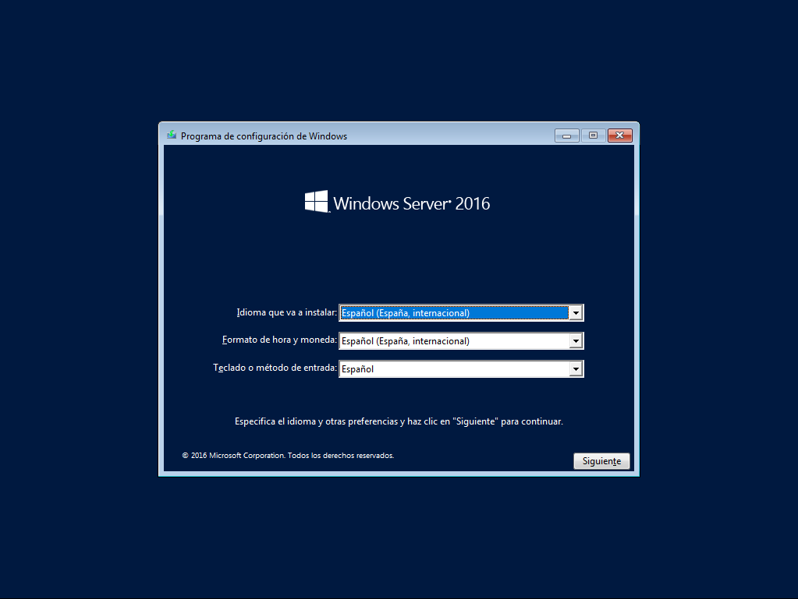
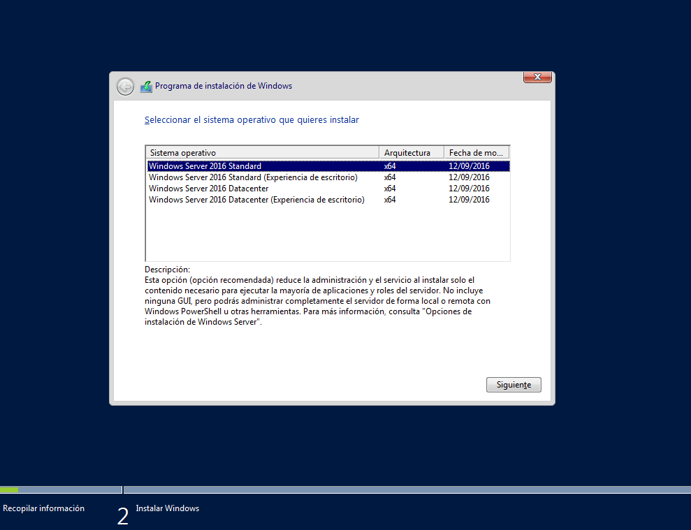
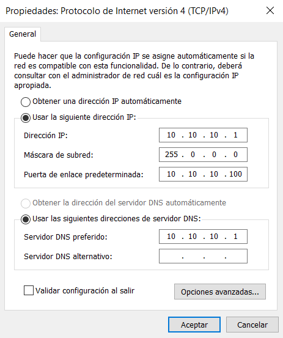

# 1. Instalación de Windows Server 2016

## **1.1 INSTALACIÓN**


**IMPORTANTE**: Si la instalación da un error antes incluso de iniciarse, compruebe que no exista en su máquina virtual un lector de floppy disk activo \(disquete\) y si es así, eliminela.


La instalación de Windows Server 2016 es prácticamente automática, solo nos pedirá que versión queremos instalar, dando varias opciones:

* _**Datacenter**_ --&gt; Permite tener infinitas máquinas virtualizadas. Supone una superficie de ataque mayor para un delincuente.
* _**Datacenter Core**_ --&gt; Es la versión Datacenter sin entorno gráfico.
* _**Standard**_ --&gt; Permite únicamente Virtualizar 2 máquinas. Por tanto, es más barata la licencia.
* _**Standard Core**_ --&gt; Es la versión Standard sin entorno gráfico.

Las versiones sin entorno gráfico suponen una superficie de ataque menor para los delincuentes.

Existen, a su vez otras tecnologías de Microsoft para gestionar servidores que son:

_**Windows Server 2016 Hyper V**_ _\*\*_--&gt; Es una tecnología de Microsoft que permite a los usuarios crear entornos de servidores virtuales y ejecutar y administrar múltiples sistemas operativos en un solo servidor físico. Además, permite la virtualización anidada. Esto tiene gran utilidad en el uso de un mismo servidor para varias aplicaciones \(correo, DNS, DHCP…\)

_**Windows Server 2016 Nanoserver**_ --&gt; Está optimizado para trabajar en la nube cargando de forma local tan solo el núcleo del sistema operativo y reduciendo aún más la superficie expuesta que en las versiones sin entorno gráfico.

Proceso de Instalación en Imágenes:

\(Hay más pantallas pero si no aparecen en el listado es por que son obvias\)


Si no introducimos una **contraseña segura** para el administrador, nos dará problemas al instalar los roles. Una contraseña segura contiene al menos 3 de los siguientes:

* Mayusculas
* Minusculas
* Números
* Símbolos

Y una longitud de al menos 8 dígitos.


## **1.2 ADMINISTRADOR DE SERVIDOR**

Una vez iniciado sesión, nos pregunta si permitimos al resto de dispositivos de la red detectar el Servidor. **CLICAMOS EN SI.**

La primera imagen que se presenta es el **Panel del Administrador de Servidores**:

**La zona de la izquierda** --&gt; Muestra los sitios y los roles que tenemos instalados. Nos permite navegar.

**La barra de menú superior** --&gt; Nos indica nuestra ubicación en el administrador e incluye las herramientas de administración. Conforme vaya añadiendo roles a mi Servidor se irán añadiendo herramientas relacionadas con estos roles.

**La** **pantalla** **principal** --&gt; Muestra el contenido del apartado seleccionado.

Cuando empezamos, solo hay un rol instalado que se corresponde con _**Servicios de Archivos y Almacenamiento**_ que podría ser entendido como un gestor de discos para el servidor.

Hay tres **conceptos** muy importantes a tener en cuenta:

_**ROL**_ --&gt; Los roles se utilizan para organizar la funcionalidad del sistema operativo. Designan las funciones principales del servidor. Con cada rol pueden ser necesarios servicios específicos, o los llamados servicios de rol. Por ejemplo, DNS o DHCP no necesitan ningún servicio adicional, pero por ejemplo el servicio de ficheros se compone de otros servicios adicionales. La idea es que según el rol elegido se carguen exclusivamente los programas necesarios.

_**CARACTERÍSTICA**_ --&gt; Además de los roles y servicios de roles también están las características. Se trata de componentes independientes de las funciones del servidor pero que pueden ser necesarios para dar apoyo a los roles. Por ejemplo, el directorio activo es una función, pero para determinadas instalaciones puede ser necesario la instalación de un componente independiente llamado WINS, en este caso se trata de una característica.

_**SERVICIO DE ROL**_ --&gt; Son programas que dan una funcionalidad directa a un rol, al instalar un rol se pueden elegir qué servicios de rol proporcionan el rol a otros usuarios y equipos de nuestra infraestructura de red.

### **1.2.1 Cambiar nombre del equipo**

En el menú lateral elegimos la opción _**Servidor Local**_ _\*\*_donde aparece toda la información del equipo.

Dentro de esta página podemos encontrar información de:

* Propiedades del Servidor
* Eventos del Servidor
* Listado de Servicios instalados en el Servidor \(activos o no\)
* Analizador de Buenas Practicas \(BPA\)
* Monitor de Rendimiento
* Roles y Características instalados en el equipo.

Para cambiar el Nombre del Equipo:

* Seleccionamos el **nombre del equipo** y aparecerán las _**Propiedades del Sistema**_.
* Click en la opción cambiar y ponemos el nombre que queremos para el equipo. Como éste equipo es el Controlador de Dominio, lo podemos llamar DC-01.
* Se reiniciará el sistema.

### **1.2.2 Asignar IP fija al servidor**


Es muy importante que todos los terminales de la red tengan una IP Fija para que no haya fallos en el sistema.


Para ello:

* Seleccionamos **Ethernet** \(En la pantalla de Servidor Local\) y se abrirá el menú de _**Conexiones de Red**._
* Seleccionamos la **conexión cableada** y se abrirá el estado de Ethernet.
* En _**Detalles**_ podemos ver la configuración actual \(**NAT**\).
* En _**Propiedades**_ ---&gt; _**Protocolo de Internet 4 \(TCP-IP v4\)**_ Podemos asignar la IP fija.

## **1.3 SISTEMA DE ARCHIVOS DE WINDOWS**

El sistema de archivos de Windows es diferente del de Linux. Es de la siguiente manera:

**C:\** --&gt; Es la partición de sistema. Todas las particiones se nombran con letras.

**Windows** --&gt; Carpeta _equivalente a sbin_, aunque contiene también:

* Librerías
* Núcleo del sistema \(**System32**\)

**Usuarios** --&gt; Equivalente a la carpeta home

**Archivos de Programa** --&gt; Equivalente a bin y user/bin \(Diferencia entre x64 y x32\)

**Perflogs** --&gt; Log del perfil de sistema

