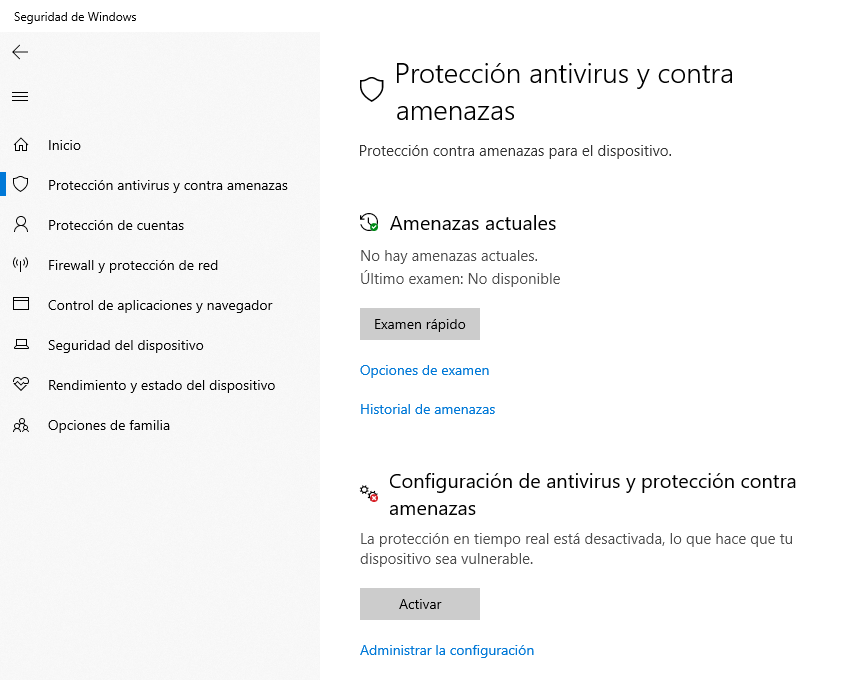
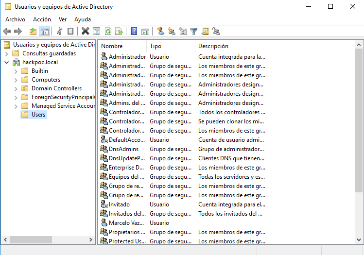
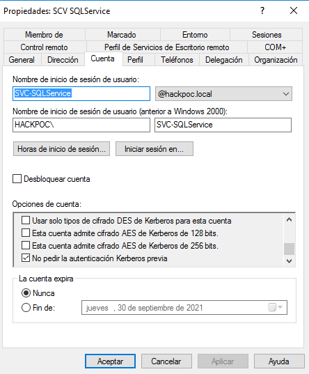

# 3. MALAS PRÁCTICAS NECESARIAS

## EXPLICACIÓN

A continuación se van a desarrollar una serie de configuraciones que son potencialmente peligrosas y, sin embargo, son habituales en los entornos empresariales reales.

De esta manera podremos desplegar nuestras herramientas y explotar las mismas vulnerabilidades que encontraríamos en un ambiente real.


Note que las siguientes imagenes son de la guía que realizó S4vitar en el siguiente [video](https://www.youtube.com/watch?v=LLevcaB4qew&list=PLlb2ZjHtNkpg2Mc3mbkdYAhEoqnMGdl2Z) por lo que el nombre de equipo del DC así como el nombre del dominio no coincidirán con el que haya puesto usted.


## 1. GENERAR RECURSO COMPARTIDO SMB

La primera configuración potencialmente peligrosa que voy a mostrar es la de generar un recurso compartido por el protocolo SMBv2.

Es una práctica habitual ya que en casi todas las organizaciones es necesario compartir recursos. El problema está en combinar ésta práctica con algunas de las siguientes.

Para ello:

### Comprobar nuestro recurso compartido

En uno de los equipos cliente que hayamos creado y una vez estemos autenticados dentro del dominio, hacemos lo siguiente:

## 2. Desactivar el Firewall de Windows

É​sta es una práctica habitual en organizaciones que utilizan aplicaciones que requieren conexión a internet. En vez de configurar correctamente el Firewall, lo desactivan y así evitan problemas de cara a dichas aplicaciones.

En los equipos cliente utilizamos a Cortana o el buscador para buscar _**Firewall de Windows Defender.**_

Una vez ahí en el panel izquierdo buscamos la opción _**Activar o desactivar el Firewall de Windows Defender**_.

Al realizar cualquier cambio nos pedirá los credenciales de Administrador.

## 3. Desactivar las protecciones del Antivirus de Windows Defender

Esto ocurre por un motivo parecido a la configuración anterior. Algunas organizaciones comienzan a tener problemas de falsos positivos con sus activos en el Antivirus de Windows Defender. En vez de solucionarlo con el servicio técnico de Microsoft o cambiar de Antivirus, la solución más sencilla es desactivarlo por completo, dando vía libre a los ataques más sencillos.

Para ello desactivaremos las protecciones del antivirus, sobre todo la **Protección en tiempo real**.


É​ste paso debe comprobarse tras cada reinicio de la máquina ya que la **Protección en tiempo real** se activa por defecto tras cada reinicio del sistema.


En los equipos cliente utilizamos a Cortana o el buscador para buscar _**Seguridad de Windows.**_

Buscamos el acceso a _**Protección contra virus y amenazas.**_

## 4. Crear usuario Administrador con Password Temporal

Tambien nos podemos encontrar con usuarios de caracter temporal a los que se les añaden comentarios para que el Administrador de dominio los tenga controlados.

## 5. Asignar un SPN al usuario creado

Utilizando el mismo usuario que hemos creado anteriormente, le vamos a dar un **SPN** \(Service Principal Name o Nombre de entidad de seguridad de Servicio en castellano\).

#### Que es un SPN



Es un ID único vinculado a servicios en los servidores. Este SPN es utilizado en la autenticación Kerberos. Con el SPN los clientes pueden identificar un servicio en la red.

#### Donde se almacenan

Para registrar un SPN el equipo y el servidor deben estar en el mismo dominio Windows o dominio de confianza. Este registro se guarda en el Active Directory.

#### Generar el SPN

Utilizando cmd en el DC: `setspn -a DC-01/admintest@laboratorio.local:60111 laboratorio\admintest`

#### Comprobar el SPN

`setspn -T laboratorio.local -Q */*`

## 6. Desactivar la firma digital por defecto

De la misma manera, es muy habitual que la firma digital se encuentre desactivada para evitar que los usuarios tengan que generar claves y puedan perderlas y \(vaya coincidencia\) poner en riesgo la seguridad de la empresa.

Para ello, realizamos el siguiente procedimiento en el DC.

Una vez ahí cambiamos a deshabilitadas las siguientes directivas:

* Cliente de redes de Microsoft: firmar digitalmente las comunicaciones \(si el servidor lo permite\)
* Cliente de redes de Microsoft: firmat digitalmente las comunicaciones \(siempre\)

Despues de ésto podemos utilizar **cmd** para utilizar el comando `gpupdate` o podemos reiniciar el DC y cuando se haya reiniciado, reiniciar los clientes. De esta manera deberían actualizarse las políticas de grupo correctamente.

## 7. Convertir un usuario en Administrador local de los clientes

En las empresas grandes, el administrador de dominio suele tener tanto trabajo que necesita de administradores locales para redes más pequeñas. Igual que utilizar SMBv2, ésta no es una práctica peligrosa en sí misma pero puede serlo si la unimos con algunas de las anteriormente explicadas.

En este caso, vamos a convertir uno de nuestros dos usuarios creados al principio \(usuarios con bajos privilegios\) en Administrador local de los dos equipos clientes. Para ello:


Esto se hace en el equipo que no es el del usuario que vamos a promover a Administrador local. Es decir, en el otro cliente.



En la siguiente foto veremos que Victor García que es el usuario habitual de ésta máquina, es tambien administrador local de la misma. Ésto es así por defecto ya que la hemos iniciado con su usuario. Sin embargo, no es administrador cuando se autentica dentro del dominio.

En cambio, el usuario mvazquez que NO es usuario habitual de esta máquina, si que es administrador local cuando está autenticado dentro del dominio.


## 8. Generar carpetas compartidas con los administradores locales

Como ya estamos viendo, éstas practicas no son peligrosas por sí solas, pero en este momento, ésta carpeta compartida es una puerta abierta para diferentes ataques.

La generamos de la siguiente manera:

Ya tenemos la carpeta compartida.

## 9. Marcar la Opción "No requiere preautenticación de Kerberos"

Otra mala práctica que nos pone en el punto de mira del AS\_REP Roast Atack es activar la opción de un usuario \(y mas si es administrador\) "No requiere preautenticación de Kerberos".

Para conseguirlo, primero entramos en el DC en "Usuarios y Grupos de Active Directory.

Una vez ahí, seleccionamos el usuario que queremos modificar con doble click y en la pestaña "Cuenta" buscamos la opcion \(que es la última\). La marcamos y aplicamos los cambios.

