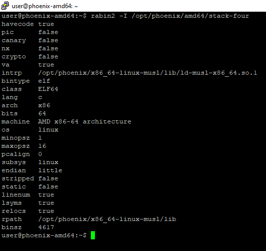
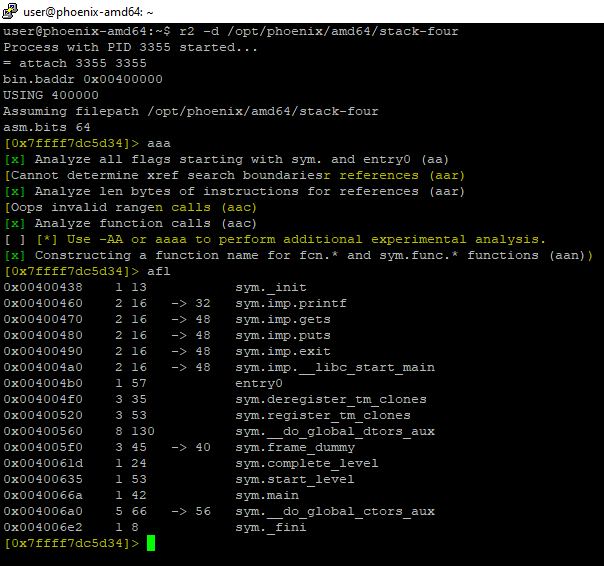
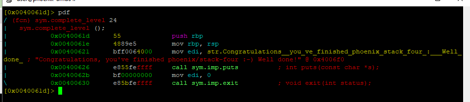
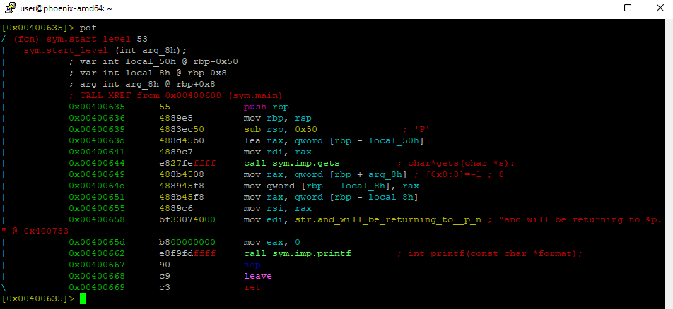
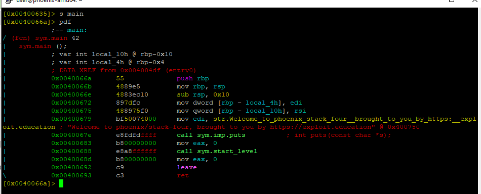
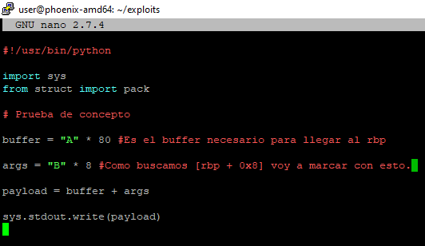
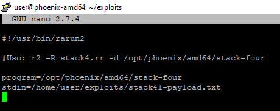
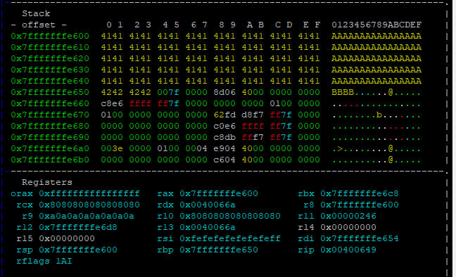
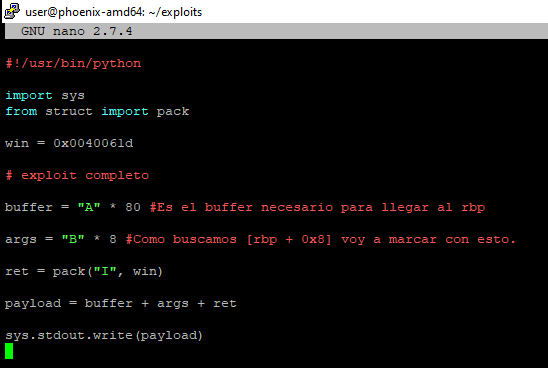
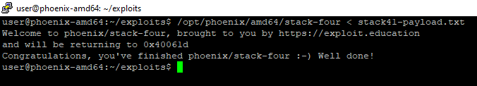

# STACK-FOUR amd64

Este nivel explica lo que puede pasar si tenemos la capacidad de sobrescribir el puntero de instrucción **rip**. Esto es lo que se considera un **Buffer Overflow estandar**.


El puntero de instrucción no siempre se encuentra justo después de las variables en el STACK. Algunas cosas como el padding del propio compilador pueden afectar a su posición.&#x20;

Algunas arquitecturas ni siquiera almacenan el puntero de instrucción en el stack.

[Link register](https://en.wikipedia.org/wiki/Link\_register)


## UTILIZANDO EL DEPURADOR

Como en todos los anteriores, lo primero es utilizar `rabin2` para obtener más información del binario:



Después lo podemos abrir en nuestro depurador, analizar todo y comprobar las funciones para ver qué estamos buscando:



Vemos que el binario utiliza las funciones **printf, gets, puts y exit**. Todas ellas las conocemos de los ejemplos anteriores así que ya sabemos que **gets** es explotable.

Además de eso, vemos que hay llamadas a tres funciones interesantes:

* **sym.complete\_level**



```nasm
// COMPLETE LEVEL

// PROLOGO
push rbp
mov rbp, rsp

// EJECUCION PRINCIPAL (Puts normal)
mov edi, str.Congratulations__you_ve_finished_phoenix_stack_four...
call sym.imp.puts 

// EXIT
mov edi, 0
call sym.imp.exit

```

Como vemos, la función complete\_level no tiene más que una llamada a puts() que no encierra ningún problema a estas alturas.

* **sym.start\_level**



```nasm
// START LEVEL

// PROLOGO
push rbp
mov rbp, rsp

// DECLARACIÓN DE VARIABLES
sub rsp, 0x50                            // resta 0x50 (80d) al rsp 

// EJECUCION PRINCIPAL
lea rax, qword [rbp - local_50h]         // carga en rax un puntero a [rbp - 0x50]
mov rdi, rax                             // mueve el puntero a rdi
call sym.imp.gets                        // llamada a gets en [rbp - 0x50]
mov rax, qword [rbp + arg_8h]            // mueve el contenido de [rbp + 0x8] a rax
mov qword [rbp - local_8h], rax          // mueve lo anterior a [rbp - 0x8]
mov rax, qword [rbp - local_8h]          // mueve a rax el valor de [rbp - 0x8]
mov rsi, rax                             // mueve dicho valor al rsi
mov edi, str.and_will_be_returning_to... // mueve la string al edi
mov eax, 0                               // mueve a eax el valor 0x0
call sym.imp.printf                      // llamada a printf

// EPILOGO
nop
leave
ret

```

Esta función ya tiene un funcionamiento más complejo. Cuando analicemos **main**, veremos **start\_level** en profundidad.


Como vemos, en radare2 los offset se pueden nombrar de dos maneras:

* `qword [rbp - local_50h]` -> equivale a `[rbp - 0x50]`
* `qword [rbp - arg_8h]` -> equivale a `[rbp + 0x8]`

Esto se debe a que las **variables locales** se almacenan **posteriormente al rbp** y por tanto en **direcciones de memoria más bajas** mientras que los **argumentos** se almacenan **previamente al rbp** y por tanto en **direcciones de memoria más altas**.

No todo lo que se almacena en direcciones de memoria más altas son argumentos, como ahora veremos.


* **sym.main**



```nasm
// MAIN

//PROLOGO
push rbp
mov rbp, rsp

// DECLARACION DE VARIABLES
sub rsp, 0x10
mov dword [rbp - local_4h], edi
mov qword [rbp - local_10h], rsi

// EJECUCION PRINCIPAL
mov edi, str.Welcome_to_phoenix_stack_four
call sym.imp.puts
mov eax, 0
call sym.start_level

// EPILOGO
|           0x0040068d      b800000000     mov eax, 0
|           0x00400692      c9             leave
\           0x00400693      c3             ret

```

La función **main** no encierra ninguna complejidad. Una llamada a puts para el BANNER y después llama directamente a la función **start\_level**. Por este motivo, se debe analizar en profundidad la función **start\_level**.

## PREPARANDO EL EXPLOIT

Si nos fijamos en la ejecución principal de la función, podemos entender un poco mejor lo que hace:

```nasm
// EJECUCION PRINCIPAL
lea rax, qword [rbp - local_50h]         // carga en rax un puntero a [rbp - 0x50]
mov rdi, rax                             // mueve el puntero a rdi
call sym.imp.gets                        // llamada a gets en [rbp - 0x50]
mov rax, qword [rbp + arg_8h]            // mueve el contenido de [rbp + 0x8] a rax
mov qword [rbp - local_8h], rax          // mueve lo anterior a [rbp - 0x8]
mov rax, qword [rbp - local_8h]          // mueve a rax el valor de [rbp - 0x8]
mov rsi, rax                             // mueve dicho valor al rsi
mov edi, str.and_will_be_returning_to... // mueve la string al edi
mov eax, 0                               // mueve a eax el valor 0x0
call sym.imp.printf                      // llamada a printf
```

Como vemos, la función hace varias cosas:

* Llamada a **gets** para llenar el buffer en `[rbp - 0x50]`.
* Justo después coge el valor de `[rbp + 0x8]` y lo mete en `[rbp - 0x8]`
* Por ultimo utiliza el valor de `[rbp - 0x8]` en un **printf** junto con una **string** que dice algo referente a la dirección de retorno.

si analizamos el **stack** justo después de la llamada a **gets**, podremos averiguar que es lo que se almacena en `[rbp - 0x8]`:

* Vamos a preparar una prueba de concepto:



* La introducimos en el debugger con rarun2:



* Comprobamos el stack justo después de gets():




Al intentar utilizar "B" \* 8, la dirección de retorno se veía afectada, por lo que para la explicación decidí utilizar "B" \* 4 y dejar otros 4 espacios libres antes de la dirección de retorno.


Como podemos ver, al llenar el **stack** con datos, hemos alcanzado la dirección con offset `[rbp + 0x4]`. Si analizamos la información de `[rbp + 0x8]` podemos ver que tiene almacenada una dirección de memoria (Little Endian) que es `0x0040068d` Si vemos el desensamblado de la función **main**, vemos que esta dirección de memoria es la dirección siguiente a la de **call start\_level**. Esto significa que hemos encontrado la dirección de retorno.

Ahora, lo único que nos queda es sobrescribir la dirección de retorno con una dirección que nos lleve a la función complete_level. En este caso, la primera dirección de complete\_level es:_ `0x0040061d`.

## EXPLOTANDO LA VULNERABILIDAD

A continuación podemos retocar nuestro exploit para que cumpla con nuestros requisitos:





Hemos conseguido sobrescribir la dirección de retorno y modificar el flujo del binario.

## CÓDIGO FUENTE

Después de comprobar que el exploit funciona podemos analizar el código fuente para comprobar qué hacía el binario exactamente.

```
/*
 * phoenix/stack-four, by https://exploit.education
 *
 * The aim is to execute the function complete_level by modifying the
 * saved return address, and pointing it to the complete_level() function.
 *
 * Why were the apple and orange all alone? Because the bananna split.
 */

#include <err.h>
#include <stdio.h>
#include <stdlib.h>
#include <string.h>
#include <unistd.h>

#define BANNER \
  "Welcome to " LEVELNAME ", brought to you by https://exploit.education"

char *gets(char *);

void complete_level() {
  printf("Congratulations, you've finished " LEVELNAME " :-) Well done!\n");
  exit(0);
}

void start_level() {
  char buffer[64];
  void *ret;

  gets(buffer);

  ret = __builtin_return_address(0);
  printf("and will be returning to %p\n", ret);
}

int main(int argc, char **argv) {
  printf("%s\n", BANNER);
  start_level();
}
```


Después de vencer el reto es importante tener en cuenta que cuando se hace referencia a `[rbp + arg_8h]` _en la función **start\_**_**level**, no se está haciendo referencia a un argumento sino a una información que se encuentra en **direcciones mayores que el rbp**. En este caso, lo que se referencia es la **dirección de retorno**.

