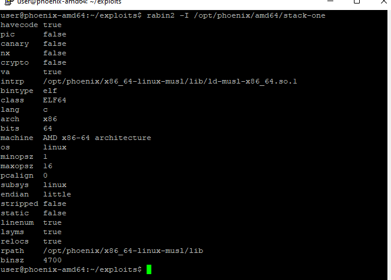
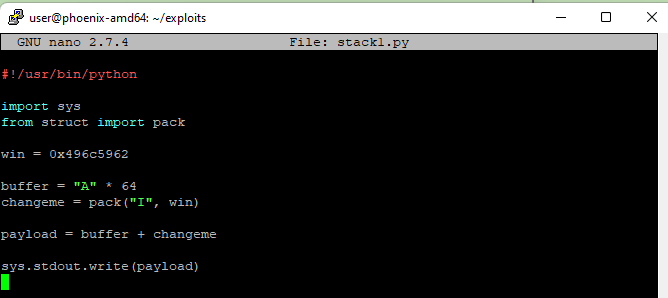
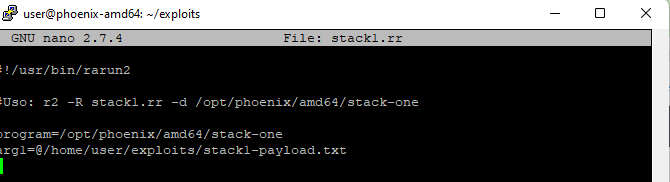
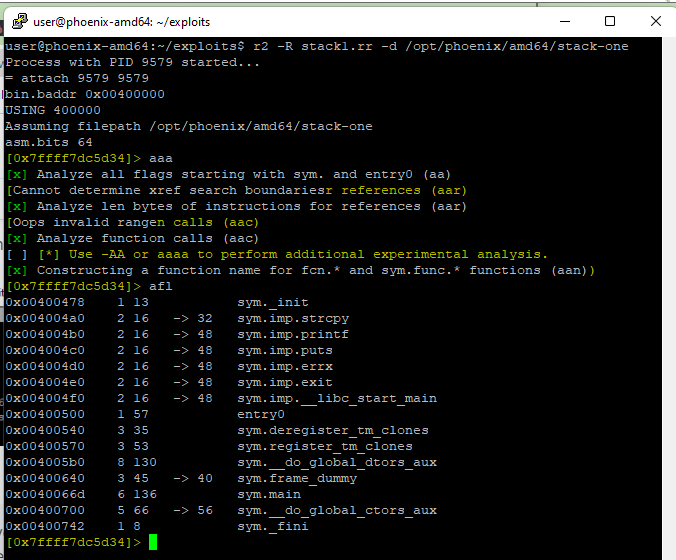
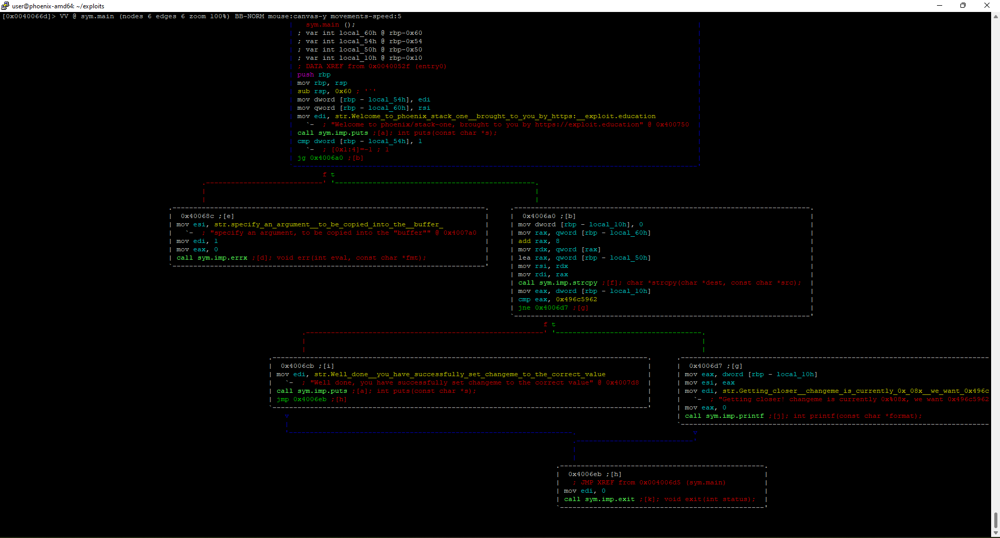
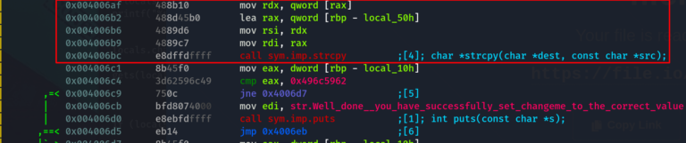
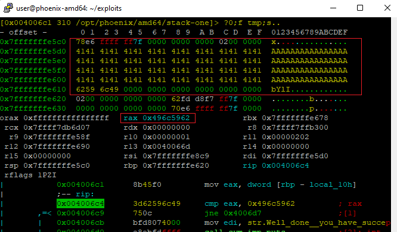
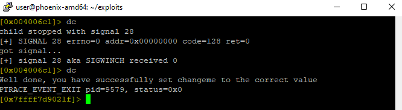

# STACK-ONE amd64

Este nivel presenta el concepto de modificar variables a valores específicos en el programa y como se encuentran dichas variables guardadas en memoria.

## CÓDIGO FUENTE

```c
/*
 * phoenix/stack-one, by https://exploit.education
 *
 * The aim is to change the contents of the changeme variable to 0x496c5962
 *
 * Did you hear about the kid napping at the local school?
 * It's okay, they woke up.
 *
 */

#include <err.h>
#include <stdio.h>
#include <stdlib.h>
#include <string.h>
#include <unistd.h>

#define BANNER \
  "Welcome to " LEVELNAME ", brought to you by https://exploit.education"

int main(int argc, char **argv) {
  struct {
    char buffer[64];
    volatile int changeme;
  } locals;

  printf("%s\n", BANNER);

  if (argc < 2) {
    errx(1, "specify an argument, to be copied into the \"buffer\"");
  }

  locals.changeme = 0;
  strcpy(locals.buffer, argv[1]);

  if (locals.changeme == 0x496c5962) {
    puts("Well done, you have successfully set changeme to the correct value");
  } else {
    printf("Getting closer! changeme is currently 0x%08x, we want 0x496c5962\n",
        locals.changeme);
  }

  exit(0);
}
```

Tras analizar el código fuente anterior podemos ver que es prácticamente similar al código de [Stack-Zero](stack-zero-amd64.md) pero con la diferencia de que el condicional IF comprueba que el valor de `locals.changeme` se ha modificado por `0x496c5962` y no únicamente que se ha modificado.

Por otro lado, el input no se introduce por **stdin** a través de una función `gets()` sino que se introduce como argumento y se le da el valor a locals.buffer con una función `strcpy()`. Aquí tenemos nuestra vulnerabilidad:


**strcpy(3) - Linux man page**

(...)

#### Bugs

If the destination string of a strcpy() is not large enough, then anything might happen.  Overflowing fixed-length string buffers is a favorite cracker technique for taking complete control of the machine.  Any time a program reads or copies data into a buffer, the program first needs to check that there's enough space.  This may be unnecessary if you can show that overflow is impossible, but be careful: programs can get changed over time, in ways that may make the impossible possible.

(...)


Por tanto podemos dividir el programa en diferentes partes:

```c
int main(int argc, char **argv) {
  struct {
    char buffer[64];
    volatile int changeme;
  } locals;

  printf("%s\n", BANNER);
```

Declaración de las variables en una estructura.

```c
if (argc < 2) {
    errx(1, "specify an argument, to be copied into the \"buffer\"");
  }

  locals.changeme = 0;
  strcpy(locals.buffer, argv[1]);
```

Comprobación de que existe un argumento (si no lo hay, lanza un error por stderr). Se da valor a las variables:

* `locals.changeme` tiene el valor de 0.
* `locals.buffer` coge el valor del argumento con la función vulnerable strcpy().

```c
if (locals.changeme == 0x496c5962) {
    puts("Well done, you have successfully set changeme to the correct value");
  } else {
    printf("Getting closer! changeme is currently 0x%08x, we want 0x496c5962\n",
        locals.changeme);
  }
```

Comprobación del valor de `locals.changeme`.  Si coincide con el valor marcado da un resultado con puts() y sino da otro con printf().&#x20;


En el último utiliza printf() por que referencia a una variable dentro del texto. Si el texto es estático, se utilizará puts().



Como podemos destacar del análisis del código fuente, tenemos dos decisiones lógicas dentro de la ejecución de main:

* Comprobar si argc < 2.
* Comprobar si locals.changeme = 0x496c5962.


De todo esto podemos imaginar que si genero el mismo payload que en el ejercicio anterior pero con el valor `0x496c5962` en vez del valor `0x43434343`, ganaré el reto.

## PREPARANDO EL EXPLOIT

El programa es bastante similar al anterior por lo que la información podemos reutilizarla en su mayoría. Solo cambia el vector de ataque (strcpy() en vez de gets()) y como resultado de esto, que utilizamos un argumento y no stdin para introducir los datos.


Aún podemos desbordar el buffer con 64 + N caracteres solo que en este caso, changeme debe contener el valor `0x496c5962`.  Esto lo podemos conseguir con un Payload en Python parecido al del ejercicio anterior. Esto lo haremos más adelante.

Para empezar vamos a utilizar rabin2 para obtener información del binario:



Como en el anterior, el binario no utiliza **ningún mecanismo de seguridad**.

También podemos comprobarlo con `checksec`.

Por tanto, el exploit en Python sería una cosa así:




Utilizamos la función pack del módulo struct para introducir la dirección de memoria en formato Little Endian.


Por otro lado, deberíamos preparar también la plantilla de rarun2:




Como podemos ver, para coger el contenido del archivo en vez de un string literal se necesita utilizar el símbolo @ antes de la ruta del payload.

Solo así podemos hacer que funcione el argumento como queremos.


## USANDO EL DEPURADOR

Como siempre que utilizamos el depurador, tras abrir el archivo procedemos a analizar todo y listar las funciones:



Después podemos decidir si utilizamos `pdf main` (print disassembly from) o `s main` (seek) para colocarse ya en las direcciones de memoria de **main**.

Pasamos a modo gráfico para ver que efectivamente hay dos puntos de decisión en el camino principal, como habíamos visto en el código fuente:



Ahora en el modo visual navegamos por los modos con `p` y aumentamos los bytes de stack que se muestran utilizando `:`&#x20;

```
:> e stack.size=128
```

Con esta visual vamos a marcar un breakpoint justo antes de la llamada a la función strcpy():



```
db 0x004006b9
dc //para continuar la ejecución hasta el breakpoint
```



Como podemos ver en el stack, la información se ha guardado invirtiendo el orden de los bytes, esto se debe a que la información se guarda en formato Little Endian.

En la última imagen vemos como se ha sobreescrito rax y ahora contiene el valor que necesitamos para superar el reto.



Para conseguir el mismo resultado fuera del depurador debemos utilizar uno de los siguientes comandos:

```
 /opt/phoenix/amd64/stack-one $(cat stack1-payload.txt)
 
 /opt/phoenix/amd64/stack-one $(./stack1.py)
```
