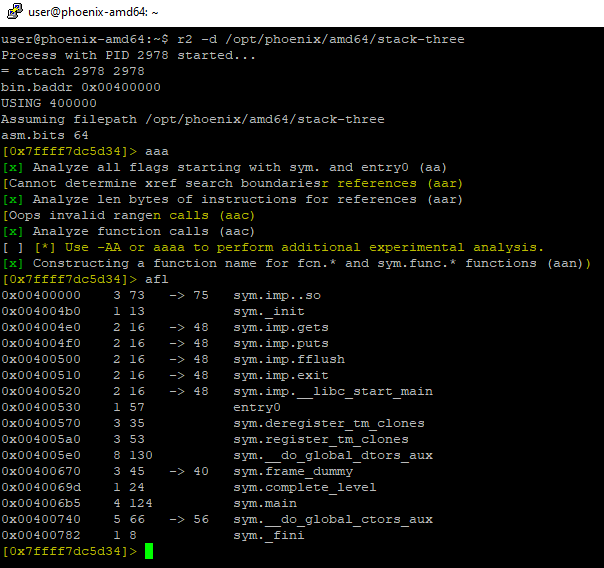
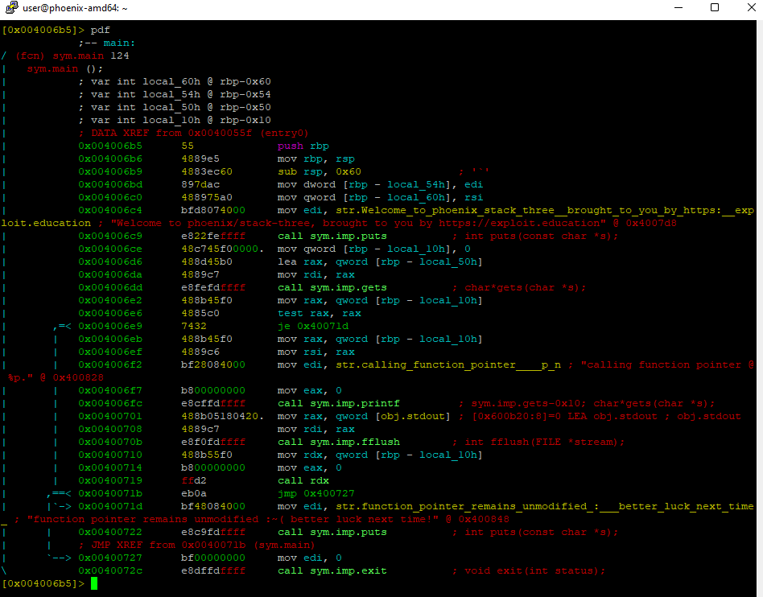
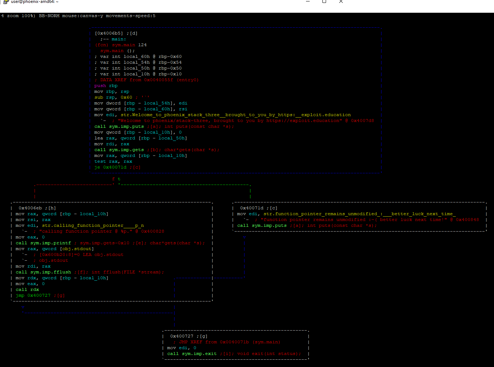
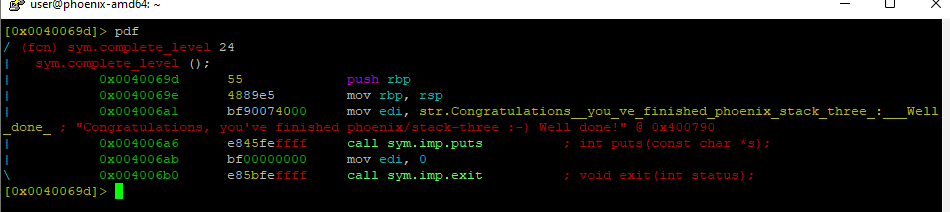
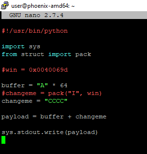
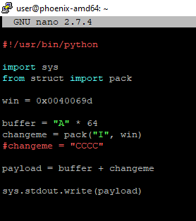
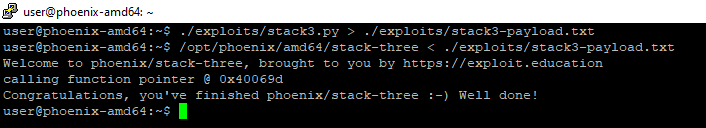

# STACK-THREE amd64

Este nivel nos enseña a sobrescribir los punteros de funciones para alterar el flujo del binario.


En este caso vamos a mirar primero el ensamblador y después contrastaremos lo descubierto con el código fuente.


## UTILIZANDO EL DEPURADOR

Como en todos los anteriores, lo primero es utilizar `rabin2` para obtener más información del binario:


Después lo podemos abrir en nuestro depurador, analizar todo y comprobar las funciones para ver qué estamos buscando:



Podemos observar las funciones gets, puts, fflush y exit, por lo que podemos asumir que se utilizan dentro del binario.


La función **fflush** no ha salido hasta ahora en los ejemplos por lo que vamos a ver que es lo que hace utilizando su página del man:

_Para flujos de salida, **fflush** () fuerza una escritura de todos los datos almacenados en el búfer del espacio de usuario para el flujo de salida o actualización dado a través de la función de escritura subyacente del flujo. Para flujos de entrada, **fflush** () descarta cualquier dato almacenado en búfer que se haya obtenido del archivo subyacente, pero que la aplicación no haya consumido. El estado abierto de la secuencia no se ve afectado._

_Si el argumento de flujo es NULL, **fflush** () vacía todos los flujos de salida abiertos._

Lo anterior significa que si utilizamos un `fflush(stdin)` después de la función gets, borrara el buffer de stdin para que no afecte a otras funciones posteriormente. Por el contrario, si utilizamos `fflush(stdout)` después de un **printf**, nos aseguramos que la información se almacena en el buffer del **kernel**, no en el de la función **printf**.


Por otro lado, llegados a este punto vemos algo muy interesante. Además de la función main, también vemos una función llamada complete\_level. Ahora toca analizar en profundidad ambas funciones:

* main:





* complete\_level:



Como en el ejercicio anterior, vamos a analizar el código. En este caso vamos a analizar primero **main** y posteriormente **complete\_level**:

```nasm
// FUNCIÓN MAIN

// PROLOGO
push rbp
mov rbp, rsp

// DECLARACIÓN DE VARIABLES
sub rsp, 0x60 
mov dword [rbp - local_54h], edi
mov qword [rbp - local_60h], rsi

// BANNER
mov edi, str.Welcome_to_phoenix_stack_three...
call sym.imp.puts

// EJECUCIÓN PROGRAMA PRINCIPAL
mov qword [rbp - local_10h], 0    // pone a cero el valor [rbp - 0x10]
lea rax, qword [rbp - local_50h]  // carga en rax un puntero a [rbp - 0x50]
mov rdi, rax                      // mueve el valor de rax a rdi
call sym.imp.gets                 // llamada a gets. Introduccion de datos por stdin.
mov rax, qword [rbp - local_10h]  // carga en rax el valor almacenado en [rbp - 0x10]
test rax, rax                     // compueba si rax = 0. Teniendo en cuenta que
                                  // [rbp - 0x10] era 0, comprueba si se ha modificado 
je 0x40071d                       // salta si [rbp - 0x10] = 0

// CAMINO != 0
mov rax, qword [rbp - local_10h]  // carga en rax el valor almacenado en [rbp - 0x10]
mov rsi, rax                      // mueve el valor de rax a rsi
mov edi, str.calling_function_pointer // mueve la string a edi
mov eax, 0                        // mueve el valor 0 a rax 
call sym.imp.printf               // llamada a la funcion printf.
mov rax, qword [obj.stdout]       // carga en rax el valor almacenado en stdout
mov rdi, rax                      // mueve el valor de rax a rdi
call sym.imp.fflush               // llamada a la funcion fflush
mov rdx, qword [rbp - local_10h]  // carga en rdx el valor almacenado en [rbp - 0x10]
mov eax, 0                        // mueve el valor 0 a rax
call rdx                          // llamada a lo que haya en rdx almacenado.
jmp 0x400727                      // salto a exit

// CAMINO = 0
mov edi, str.function_pointer_remains_unmodified_:___better_luck_next_time_
call sym.imp.puts                 // llamada a puts

// FUNCIÓN EXIT
|      `--> 0x00400727      bf00000000     mov edi, 0
\           0x0040072c      e8dffdffff     call sym.imp.exit          ; void exit(int status);

```

```nasm
// FUNCIÓN COMPLETE_LEVEL

// PROLOGO
push rbp
mov rbp, rsp

// EJECUCION DEL CODIGO
mov edi, str.Congratulations__you_ve_finished_phoenix_stack_three_:___Well_done_
call sym.imp.puts    // llamada a la funcion puts
mov edi, 0           // mueve el valor 0 a edi
call sym.imp.exit    // llamada a la funcion exit

```

De lo leído anteriormente, vemos que en un momento dado de la función **main** se llama a una función cuyo puntero se encuentra almacenado en una variable, concretamente en `[rbp - 0x10]`.

Además, antes de eso se ha introducido datos por stdin con la función **gets** en la variable que se encuentra almacenada en `[rbp - 0x50]`.

Sabemos que la función gets tiene problemas de seguridad y es explotable para escribir en direcciones de memoria cercanas. En este caso, solo tenemos que escribir `0x50 - 0x10` bytes para empezar a sobrescribir el puntero de la función. Esto son 64  bytes.

Otra cosa a tener en cuenta es: ¿Qué dirección debo poner en el puntero para ganar el reto?

Lo importante para ganar este reto es redirigir el flujo de programa hacia la función complete\_level.  Por tanto, debemos introducir la dirección de la primera instrucción de este función en el puntero para redirigirme a ella. En este caso `0x0040069d`.

A continuación prepararemos el exploit y después confirmaremos que lo anterior es correcto.

## PREPARANDO EL EXPLOIT

Ahora que ya sabemos cómo funciona el binario y creemos saber como explotarlo, vamos a preparar un exploit en python para comprobar que estábamos en lo cierto:



Con este exploit, podemos ejecutar el binario para comprobar si hemos modificado el valor del puntero y trata de acceder a la función almacenada en `0x43434343`.


Ya hemos comprobado que nuestro analisis del código ensamblador ha sido correcto. Ahora podemos modificar el exploit para obtener el resultado que esperamos y vencer el reto:





Otra vez, no ha sido necesario conocer el código fuente para explotar el binario.

## CÓDIGO FUENTE

Después de comprobar que el exploit funciona podemos analizar el código fuente para comprobar qué hacía el binario exactamente.

```c
/*
 * phoenix/stack-three, by https://exploit.education
 *
 * The aim is to change the contents of the changeme variable to 0x0d0a090a
 *
 * When does a joke become a dad joke?
 *   When it becomes apparent.
 *   When it's fully groan up.
 *
 */

#include <err.h>
#include <stdio.h>
#include <stdlib.h>
#include <string.h>
#include <unistd.h>

#define BANNER \
  "Welcome to " LEVELNAME ", brought to you by https://exploit.education"

char *gets(char *);

void complete_level() {
  printf("Congratulations, you've finished " LEVELNAME " :-) Well done!\n");
  exit(0);
}

int main(int argc, char **argv) {
  struct {
    char buffer[64];
    volatile int (*fp)();
  } locals;

  printf("%s\n", BANNER);

  locals.fp = NULL;
  gets(locals.buffer);

  if (locals.fp) {
    printf("calling function pointer @ %p\n", locals.fp);
    fflush(stdout);
    locals.fp();
  } else {
    printf("function pointer remains unmodified :~( better luck next time!\n");
  }

  exit(0);
}
```
