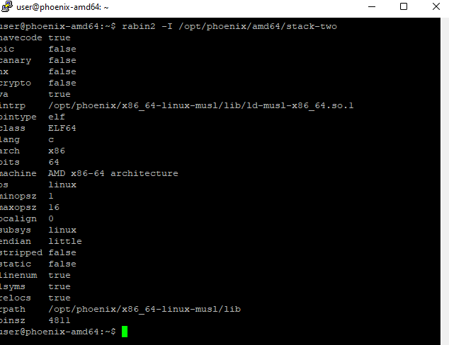
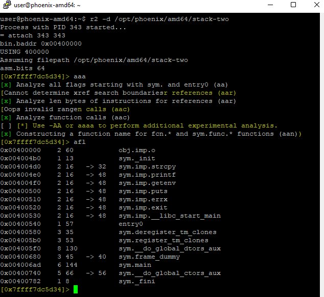
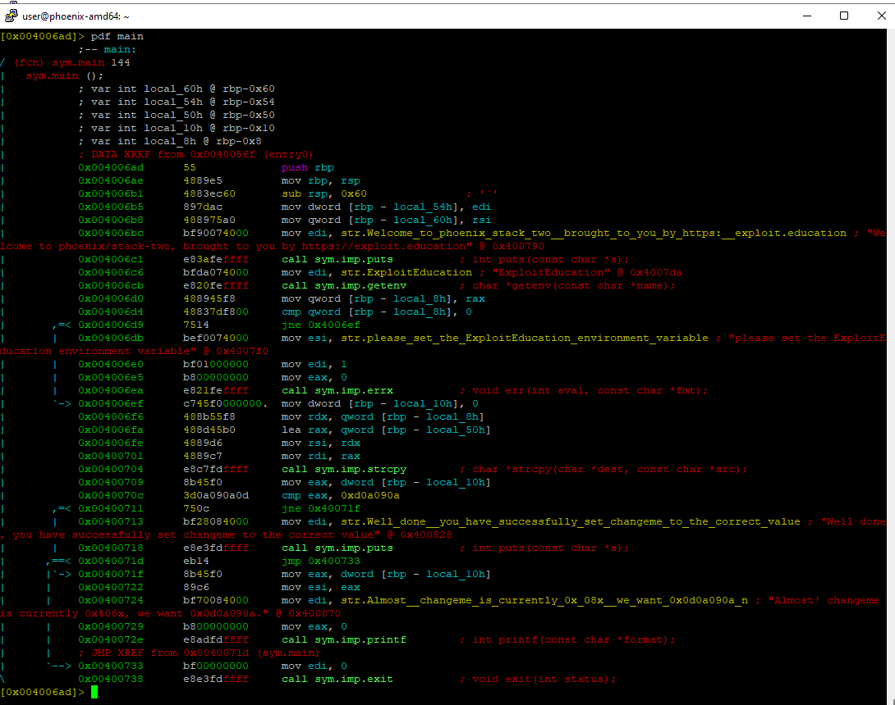
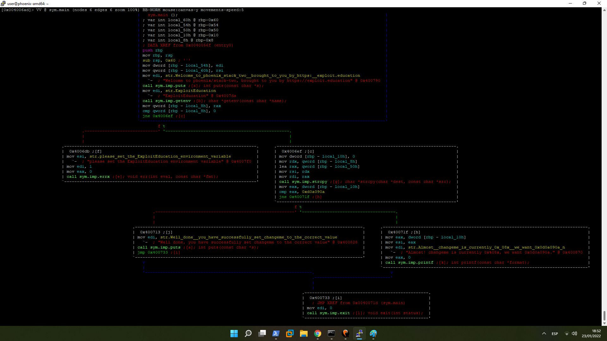
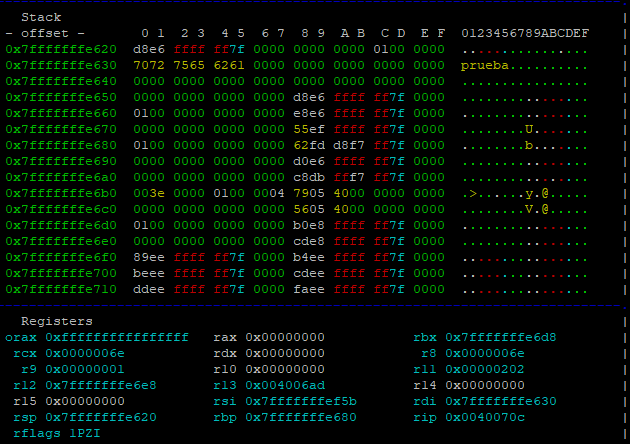
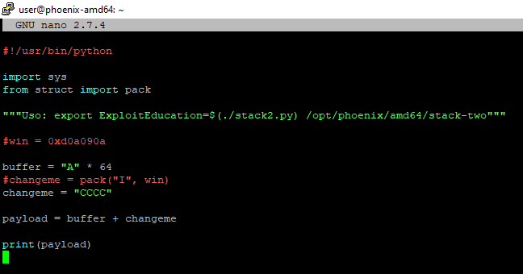
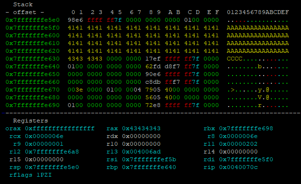
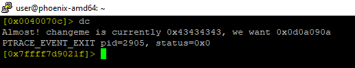
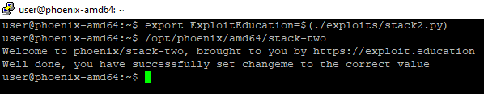

# STACK-TWO amd64

Este nivel muestra las variables de entorno y como pueden definir para nuestro beneficio.


En este caso vamos a mirar primero el ensamblador y después contrastaremos lo descubierto con el código fuente.


## UTILIZANDO EL DEPURADOR

Como en todos los anteriores, lo primero es utilizar `rabin2` para obtener más información del binario:



Después lo podemos abrir en nuestro depurador, analizar todo y comprobar las funciones para ver qué estamos buscando:




Podemos observar que las funciones `strcpy, printf, getenv, puts, errx y exit` se encuentran en el binario por lo que lo más probable es que se utilicen en el código. De todas las anteriores, la única que no se ha visto es **`getenv`**:

`The getenv() function searches the environment list to find the environment variable name, and returns a pointer to the corresponding value string.`


Ahora que hemos comprobado que la única función interesante, a primera vista, es main, podemos ver su código ensamblador:





Vamos a analizar este código:

```nasm
// PROLOGO
push rbp
mov rbp, rsp

// DEFINICION DE VARIABLES
sub rsp, 0x60
mov dword [rbp - local_54h], edi
mov qword [rbp - local_60h], rsi

// FUNCION PUTS UTILIZADA PARA EL BANNER
mov edi, str.Welcome_to_phoenix_stack_two...
call sym.imp.puts

// 
mov edi, str.ExploitEducation     // introduce en el registro edi la str ExploitEducation
call sym.imp.getenv               // busca el valor de la variable de entorno guardada en el edi
mov qword [rbp - local_8h], rax   // guarda su valor en el registro rax
cmp qword [rbp - local_8h], 0     // Comprueba la existencia de la variable. cmp with 0
jne 0x4006ef                      // Inicia la decisión lógica:

// CAMINO = 0                     // implica que la variable de entorno no está definida:
mov esi, str.please_set_the_ExploitEducation_environment_variable
mov edi, 1
mov eax, 0
call sym.imp.errx                 // lanza el error consecuente.

// CAMINO != 0                    // implica que la variable tiene un valor
mov dword [rbp - local_10h], 0    // da el valor 0 a una variable almacenada en rbp - 0x10
mov rdx, qword [rbp - local_8h]   // mete en rdx el valor de la variable almacenada en rbp - 0x8
                                  // recordemos que este es el puntero al valor de la variable de entorno ExploitEducation

lea rax, qword [rbp - local_50h]  // carga en rax la direccion de memoria de la variable almacenada en rbp - 0x50
mov rsi, rdx                      // mueve el valor de rdx a rsi
mov rdi, rax                      // mueve el valor de rax a rdi
call sym.imp.strcpy               // llamada a la función strcpy.
                                  // seguramente copie el valor de la variable de entorno ExploitEducation

mov eax, dword [rbp - local_10h]  // mueve al registro eax el valor de la variable rbp - 0x10 (habia sido puesta a 0)
cmp eax, 0xd0a090a                // compara el eax con 0xd0a090a
jne 0x40071f

// CAMINO = 0xd0a090a             // Implica que el valor de la variable se ha modificado a 0xd0a090a
 mov edi, str.Well_done__you_have_successfully_set_changeme_to_the_correct_value
 call sym.imp.puts          ; int puts(const char *s);
 jmp 0x400733                     // salto a exit
 
// CAMINO != 0xd0a090a            // Implica que el valor de la variable no se ha modificado correctamente.
mov eax, dword [rbp - local_10h]
mov esi, eax
mov edi, str.Almost__changeme_is_currently_0x_08x__we_want_0x0d0a090a_n
mov eax, 0
call sym.imp.printf

//exit
mov edi, 0
call sym.imp.exit
```

Con el análisis anterior podemos identificar que el programa:

1. Comprueba si una variable de entorno existe o no.
2. Si existe, define una variable con el valor cero.
3. Más tarde, copia un valor en el stack (previsiblemente el valor de la variable de entorno)
4. Por último, comprueba que la variable que ha almacenado antes con el valor 0, ha cambiado su valor a `0xd0a090a`.

Por lo tanto, y si analizamos la estructura del stack justo antes de comparar el valor de \[rbp - 0x10] con `0xd0a090a`, veremos que debemos utilizar el contenido de la variable de entorno ExploitEducation para alterar el valor de la variable que se encuentra a su lado almacenada en el stack:



El rbp es `0x7fffffffe680` que coincide con una dirección de memoria que vemos en el stack. Además, vemos que la variable de entorno (ExploitEducation=prueba) se encuentra almacenada en `0x7fffffffe630`. Si hacemos la resta, podemos ver que entre ambas direcciones de memoria hay justamente `0x50` bytes (lo que equivale a **50 bytes** en decimal).

Con esto confirmamos que la variable que se almacenaba en `[rbp - 0x50]` es la variable de entorno.&#x20;

Si ahora comprobamos el contenido de `[rbp - 0x10]`, veremos que el contenido es 0x00000000. Esto es así por qué se ha definido su valor 0x0 en algún momento de la ejecución del programa.

Por tanto, entre `0x50` y `0x10` hay `0x40` bytes o lo que es lo mismo **64 bytes** en decimal. Esto implica que puedo sobreescribir la información almacenada en `[rbp - 0x10]` para que coincida con `0xd0a090a` y asi ganar el reto.&#x20;

## PREPARANDO EL EXPLOIT

Ahora que ya sabemos cómo funciona el binario y creemos saber como explotarlo, vamos a preparar un exploit en python para comprobar que estabamos en lo cierto:



Como podemos ver, el exploit se aplica a la variable de entorno y después se ejecuta el binario. Si en este caso volvemos a comprobar el stack en el mismo punto, la estructura habrá cambiado:



Como vemos, **rbp** `0x7fffffffe640` y por tanto en `[rbp - 0x10]` que equivale a `0x7fffffffe630`, podemos encontrar nuestra string "**CCCC**" o lo que es lo mismo `0x43434343`.

Si llevamos la ejecución hasta su final, podemos comprobar que estábamos en lo cierto:



## EXPLOTANDO LA VULNERABILIDAD

Con todo lo anterior comprobado, podemos modificar nuestro exploit anterior para que modifique changeme por el valor necesario:


Con el exploit terminado, podemos probar a ver si funciona:



Ahora si hemos explotado un binario sin ni siquiera conocer su código fuente.

## CÓDIGO FUENTE

Después de comprobar que el exploit funciona podemos analizar el código fuente para comprobar qué hacía el binario exactamente.

```c
/*
 * phoenix/stack-two, by https://exploit.education
 *
 * The aim is to change the contents of the changeme variable to 0x0d0a090a
 *
 * If you're Russian to get to the bath room, and you are Finnish when you get
 * out, what are you when you are in the bath room?
 *
 * European!
 */

#include <err.h>
#include <stdio.h>
#include <stdlib.h>
#include <string.h>
#include <unistd.h>

#define BANNER \
  "Welcome to " LEVELNAME ", brought to you by https://exploit.education"

int main(int argc, char **argv) {
  struct {
    char buffer[64];
    volatile int changeme;
  } locals;

  char *ptr;

  printf("%s\n", BANNER);

  ptr = getenv("ExploitEducation");
  if (ptr == NULL) {
    errx(1, "please set the ExploitEducation environment variable");
  }

  locals.changeme = 0;
  strcpy(locals.buffer, ptr);

  if (locals.changeme == 0x0d0a090a) {
    puts("Well done, you have successfully set changeme to the correct value");
  } else {
    printf("Almost! changeme is currently 0x%08x, we want 0x0d0a090a\n",
        locals.changeme);
  }

  exit(0);
}
```
