# STACK-ZERO amd64

Este nivel introduce el concepto de que la memoria puede ser accedida, en ocasiones, fuera de la región predefinida, como se almacenan las variables en la pila y el hecho de que modificar la memoria fuera de los límites marcados puede modificar la ejecución del programa.

## CÓDIGO FUENTE

```c
/*
 * phoenix/stack-zero, by https://exploit.education
 *
 * The aim is to change the contents of the changeme variable.
 *
 * Scientists have recently discovered a previously unknown species of
 * kangaroos, approximately in the middle of Western Australia. These
 * kangaroos are remarkable, as their insanely powerful hind legs give them
 * the ability to jump higher than a one story house (which is approximately
 * 15 feet, or 4.5 metres), simply because houses can't can't jump.
 */

#include <stdio.h>
#include <stdlib.h>
#include <string.h>
#include <unistd.h>

#define BANNER \
  "Welcome to " LEVELNAME ", brought to you by https://exploit.education"

char *gets(char *);

int main(int argc, char **argv) {
  struct {
    char buffer[64];
    volatile int changeme;
  } locals;

  printf("%s\n", BANNER);

  locals.changeme = 0;
  gets(locals.buffer);

  if (locals.changeme != 0) {
    puts("Well done, the 'changeme' variable has been changed!");
  } else {
    puts(
        "Uh oh, 'changeme' has not yet been changed. Would you like to try "
        "again?");
  }

  exit(0);
}
```

Con un conocimiento básico de programación en C podemos ver que el programa es bastante sencillo. Comenzando en la función **main** (linea 23), podemos ver que lo primero que se crea es una **estructura** con el nombre **locals** dos **miembros**: un array de 64 caracteres y un entero con el prefijo **volatile**.

```c
struct {
    char buffer[64];
    volatile int changeme;
  } locals;
```


&#x20;Una **estructura** es un tipo de dato compuesto que permite almacenar un conjunto de datos de diferente tipo. Los datos que contiene una estructura pueden ser de tipo simple (caracteres, números enteros o de coma flotante etc.) o a su vez de tipo compuesto (vectores, estructuras, listas, etc.).

&#x20;A cada uno de los datos o elementos almacenados dentro de una estructura se les denomina **miembros** de esa estructura y éstos pertenecerán a un tipo de dato determinado.&#x20;


En una estructura lo normal es que los miembros se almacenen en memoria uno al lado del otro , como se muestra en la imagen a continuación:

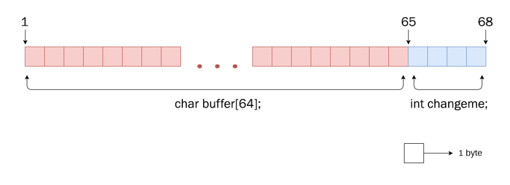


**Volátil** le dice al compilador que no optimice nada que tenga que ver con la variable volátil.

Hay al menos tres razones comunes para usarlo, todas involucrando situaciones en las que el valor de la variable puede cambiar sin acción del código visible: cuando interactúa con hardware que cambia el valor en sí mismo; cuando hay otro hilo en ejecución que también usa la variable; o cuando hay un controlador de señal que puede cambiar el valor de la variable.


Lo que se consigue en el código de ejemplo con el uso del modificador **volatile** es que la variable **changeme** se lea siempre desde memoria y no se almacene previamente en un registro.&#x20;

Después podemos ver la siguiente parte del código que da a la variable changeme el valor 0. Justo después se pide imput al usuario con una función gets().

Por último el programa comprueba si la variable changeme sigue valiendo cero o se ha modificado.

Ganamos si conseguimos modificar la variable.

```c
  locals.changeme = 0;
  gets(locals.buffer);

  if (locals.changeme != 0) {
    puts("Well done, the 'changeme' variable has been changed!");
  } else {
    puts(
        "Uh oh, 'changeme' has not yet been changed. Would you like to try "
        "again?");
```

La función gets() almacena el imput del usuario en locals.buffer  que contiene 64 bytes de espacio. Sin embargo dicha función es conocida por no comprobar los límites al recibir un imput para un buffer de tamaño fijo. Esto lo podemos ver en la página del man de gets():


**gets(3) - Linux man page**

**(...)**

#### Bugs

Never use **gets**(). Because it is impossible to tell without knowing the data in advance how many characters **gets**() will read, and because **gets**() will continue to store characters past the end of the buffer, it is extremely dangerous to use. It has been used to break computer security. Use **fgets**() instead.

**(...)**


Con todo lo visto anteriormente podemos ver que si lanzamos un imput superior a 64 bytes podremos modificar el valor de **changeme**.

## UTILIZANDO EL DEPURADOR


Para obtener más información acerca de radare2 recomiendo:

[https://book.rada.re/index.html](https://book.rada.re/index.html)

[https://monosource.gitbooks.io/radare2-explorations/content/introduction.html](https://monosource.gitbooks.io/radare2-explorations/content/introduction.html)


Antes de comenzar con el desensamblado, vamos a ejecutar el programa a ver qué es lo que se ve desde el cliente:

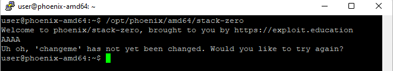

El programa permite al usuario introducir los datos que desee desde stdin y los almacenará en **locals.buffer**. Esto es lo que vamos a explotar para modificar **locals.changeme**.

Para obtener más información del archivo ejecutamos **rabin2**. Así nos podemos hacer una mejor idea de las protecciones activas en el binario:

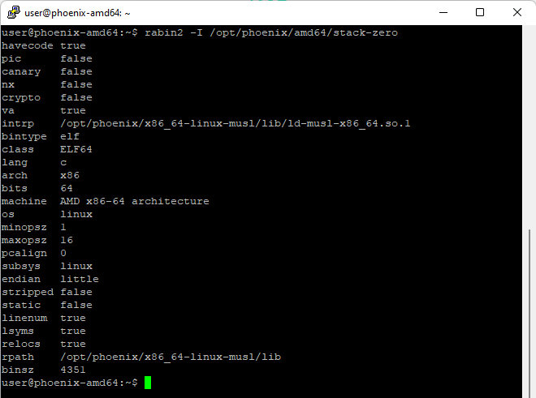

El output del programa lista detalladamente la información acerca del binario, incluyendo mecanismo de seguridad activos o desactivados.


Es muy importante comprobar la seguridad de un binario antes de lanzarse a un exploit.


Otra herramienta para obtener esta información es **checksec**:

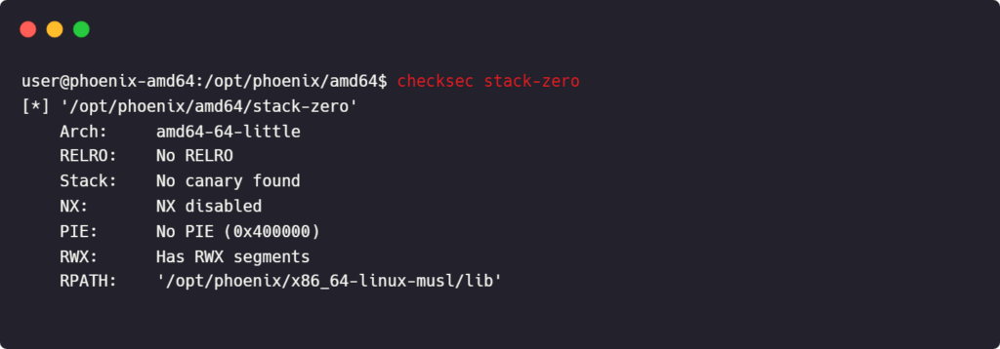

Como podemos ver tanto con rabin2 como con checksec, el binario tiene desactivadas todas las mitigaciones.&#x20;

Ahora ya podemos abrir el binario con **radare2**. Para ello utilizamos el comando **r2** y la flag **-d** para abrir el binario en modo debug.

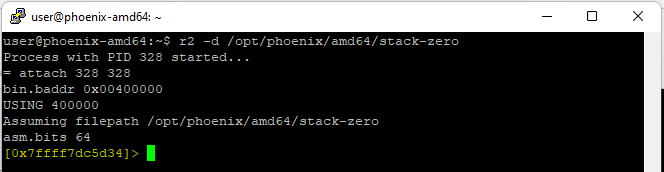

Al iniciar el proceso obtenemos lo anterior: el PID del proceso, el punto de inicio en memoria y los bits en ensamblador.

A continuación vamos a analizar el código referenciado en el binario. Para empezar vamos a analizar todo con **aaa**

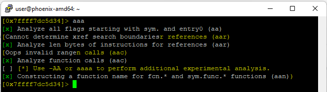

A partir de aquí podríamos listar las funciones existentes en el binario con el comando **afl** (analize function list) y desensamblar la sección que deseemos con **pdf** (print disassembly from):

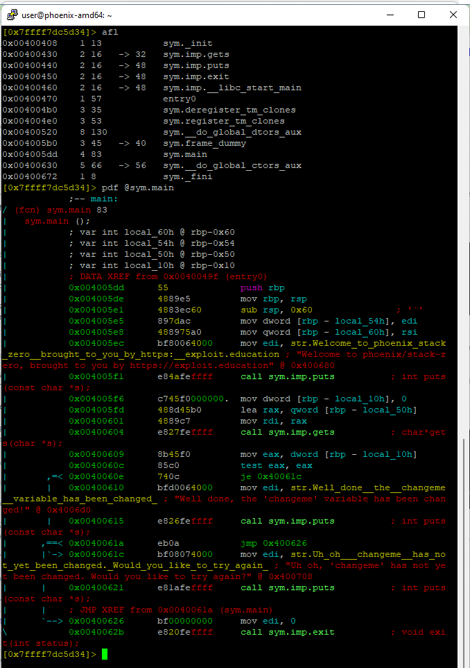

Tambien podemos ubicarnos en la dirección de memoria que queramos con el comando **s** (seek) seguido de la sección que deseamos encontrar:

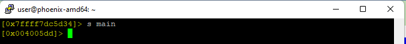

Como podemos ver la dirección de memoria mostrada ha cambiado de `0x7ffff7dc5d34` a `0x004005dd` lo que equivale a la dirección de memoria donde empieza la función main.

Con el comando **v** (visual) podemos acceder al modo visual y si en este modo presionamos la `tecla espacio`, llegamos al modo gráfico. en cambio, si presionamos la `tecla p volviendo atrás con P`:

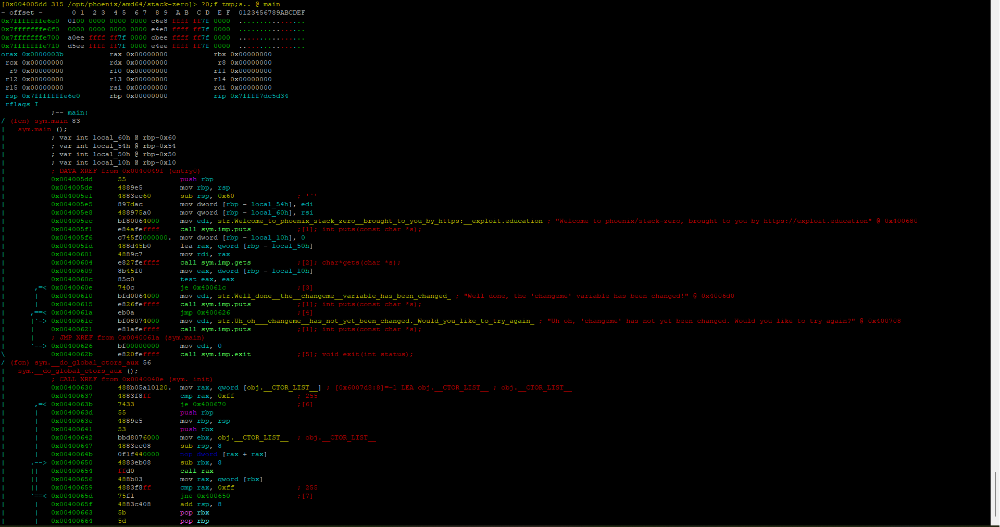

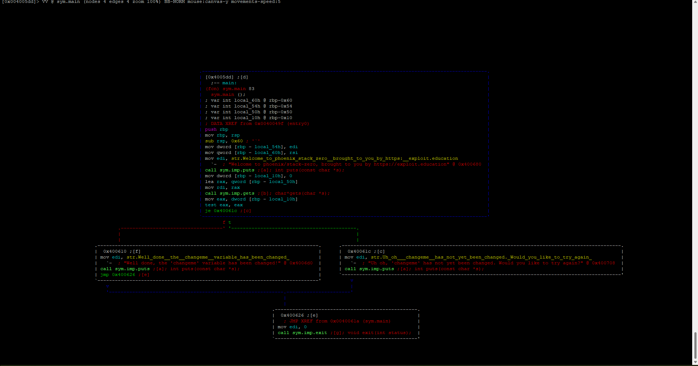

Con éste modo gráfico podemos ver los diferentes caminos lógicos que puede seguir un programa en función de determinadas condiciones lógicas.

Para salir de este modo presiona `q` hasta salir al prompt de radare2.

Para entender el código ensamblador vamos a compararlo con el código fuente en C recordando lo que ya conocemos:

```c
                                   // PROLOGO
int main(int argc, char **argv) {  // push rbp
                                   // mov rbp, rsp


  struct {                         // sub rsp, 0x60
    char buffer[64];               // mov DWORD PTR [rbp - 0x54], edi
    volatile int changeme;         // mov QWORD PTR [rbp - 0x60], rsi
  } locals;
  printf("%s\n", BANNER);          // mov edi, 0x400680
                                   // call 400440 <puts@plt>
  
  locals.changeme = 0;             // mov DWORD PTR [rbp - 0x10], 0x0
  
  gets(locals.buffer);             // lea rax, [rbp - 0x50]
                                   // mov rdi, rax
                                   // call 400430 <gets@plt>
                                   
  if (locals.changeme != 0) {      // ESTRUCTURA IF EN ENSAMBLADOR
                                   // mov eax, DWORD PTR [rbp - 0x10] 
                                   // test eax, eax
                                   // je 40061c <main + 0x3f>
                                   
    puts("var  changed!");         // mov edi, 0x4006d0
                                   // call 400440 <puts@plt>
                                   
  } else {                          
    puts(                          // mov edi, 0x400708
        "var not yet changed.");   // call 400440 <puts@plt>
  }

  exit(0);                         // EPILOGO
                                   // mov edi, 0x0
                                   // call 400450 <exit@plt>
}
```

## PREPARANDO EL EXPLOIT

Viendo el código anterior queda claro que para afectar el `je 40061c` debemos desbordar el buffer de `locals.buffer` a través de `gets()`. Para probarlo creamos un exploit básico en Python que introduciremos en **radare2** a través de **rarun2** en vez de utilizar pipes directamente.


**rarun 2**

Este programa se utiliza como ejecutador de programas con diferentes variables de entorno, argumentos, permisos, directorios y descriptores de archivos en **radare2**


#### Exploit en Python

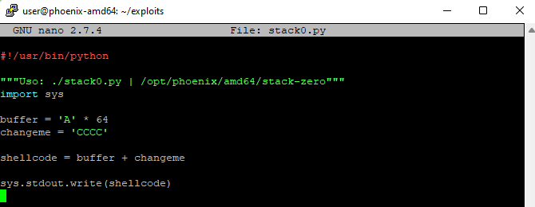

Como vemos, la salida de este exploit se realiza por stdout. Por tanto podemos colectar la salida en un archivo .txt

```shell
./stack0.py > stack0-payload.py
```

#### Plantilla de rarun2

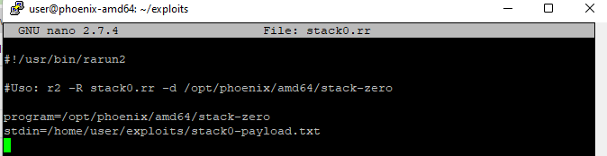

Como vemos, la plantilla de rarun2 se inicia con la dirección del interprete de rarun2 y después incluye una línea en la que marcamos el **binario** a ejecutar y otra en la que marcamos lo que se le va a introducir por **stdin**.


Para ver más funcionalidades de rarun2, ver:

[https://r2wiki.readthedocs.io/en/latest/tools/rarun2/](https://r2wiki.readthedocs.io/en/latest/tools/rarun2/)


## EXPLOTANDO LA VULNERABILIDAD

Una vez lo tenemos todo listo, podemos ejecutar el binario con radare2 añadiendo el contenido de la plantilla de rarun2 con el comando:

```
r2 -R stack0.rr -d /opt/phoenix/amd64/stack-zero
```

Lo primero que debemos hacer es analizar todo con los comando `aaa` y `afl` que hemos visto anteriormente.

Posteriormente pasamos al modo visual y nos movemos con `p` hasta la vista que queremos. En este caso la vista del ensamblador con información de los registros y del stack.

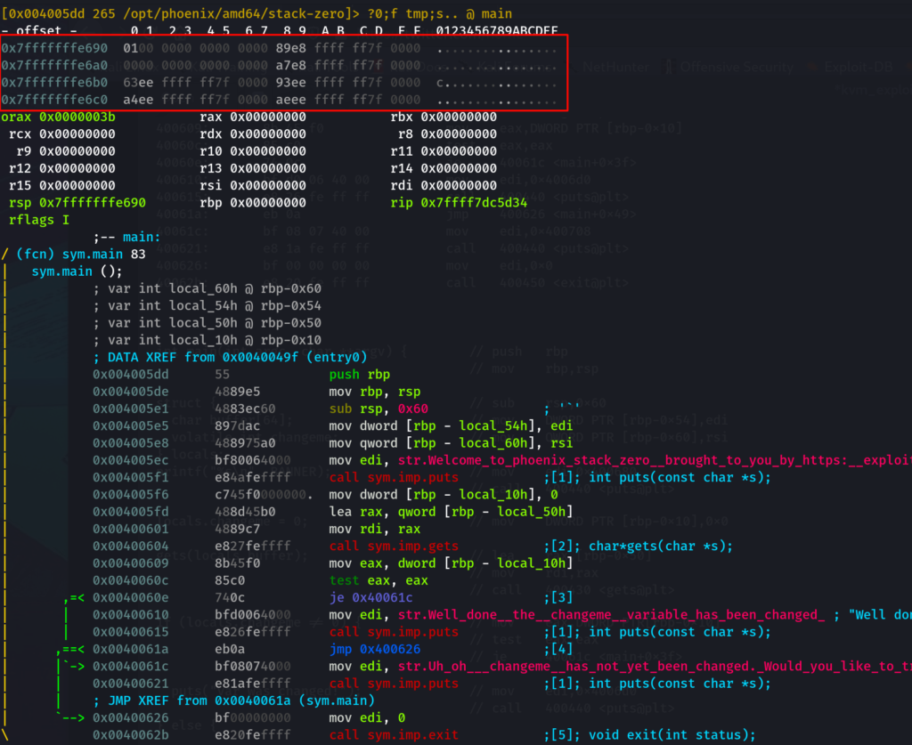

Como vemos, en esta vista se muestran 64 bytes del stack. Como nosotros queremos ver más, podemos modificarlo simplemente pulsando la `tecla :` y utilizando el siguiente comando:

```
:> e stack.size=128
```

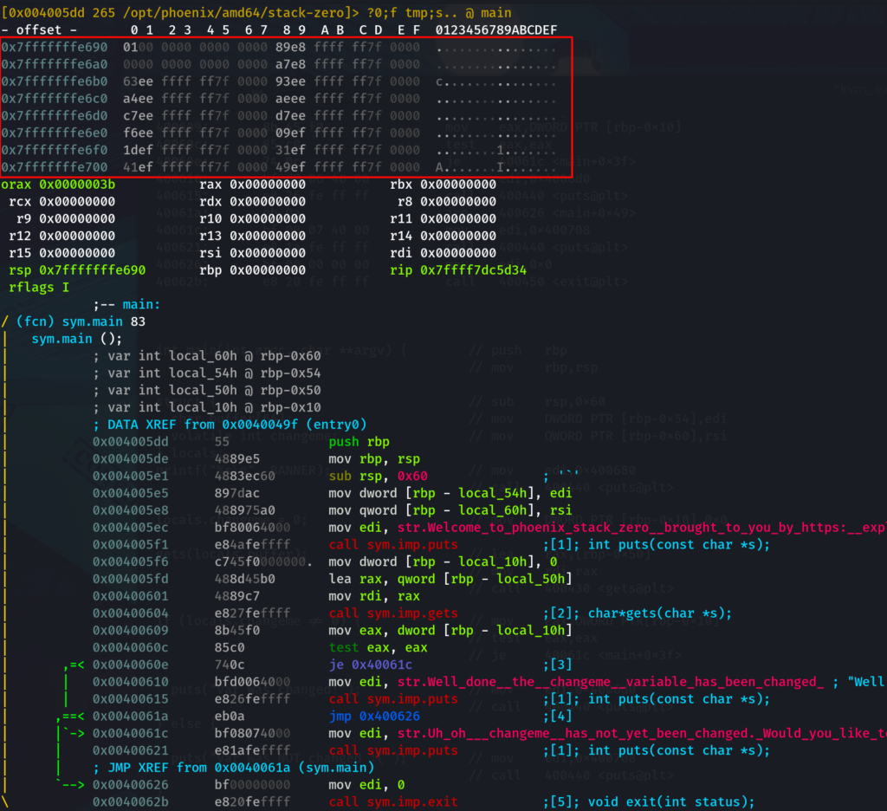

Vemos que la imagen muestra ahora 128 bytes del stack.

A continuación vamos a marcar un breakpoint justo después de la llamada a la función `gets()` en la dirección de memoria `0x00400609`. Para ello utilizamos el comando `db 0x00400609` (define breakpoint).

En este punto, `locals.buffer` debería haber sobrescrito el valor de `locals.changeme` que se encontraba en `[rbp - local_10h]`. Esto se debe a que el buffer de 64 bytes se llena y los siguientes bytes escritos (en este caso CCCC o 0x43434343 en hexadecimal) sobrescriben los espacios de memoria inmediatamente siguientes.&#x20;

En este caso, teniendo en cuenta que `locals.buffer` empezaba en `[rbp - local_50h]` si hacemos la cuenta, `0x50 - 0x10 = 64 bytes`.  Por este motivo, si escribimos m'as de 64 bytes es evidente que sobrescribimos los datos de `[rbp - 0x10]`, es decir, sobrescribimos `locals.changeme`.

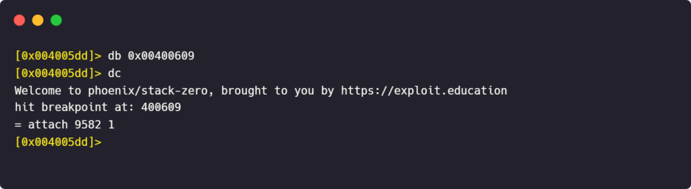

Con el comando dc (define continue) hacemos que el programa se ejecute hasta tocar el siguiente breakpoint.&#x20;

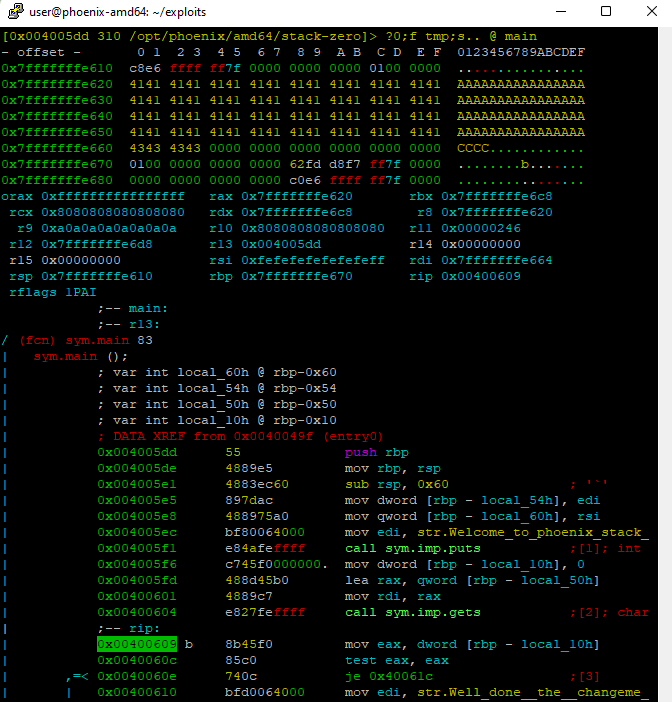

Con el comando ds (define step) hacemos que el programa pase a la siguiente instrucción de ensamblador. En este punto vemos que el `registro rax` contiene `0x43434343` y ya no es `0x00000000`. Esto significa que se ha sobreescrito el valor de changeme que ahora vale, en ASCII, CCCC.

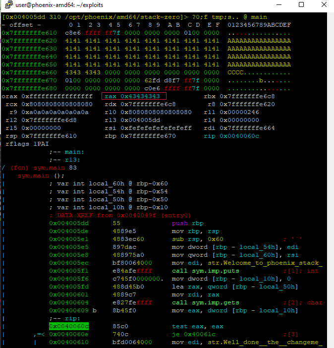

Por lo tanto, hemos corrompido la memoria, cambiado el contenido a voluntad y ganado el reto.

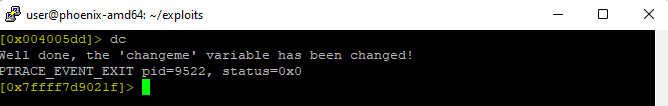

Para obtener el mismo resultado fuera del depurador, debemos utilizar el comando:

```
/opt/phoenix/amd64/stack-zero < stack0-payload.txt
```
