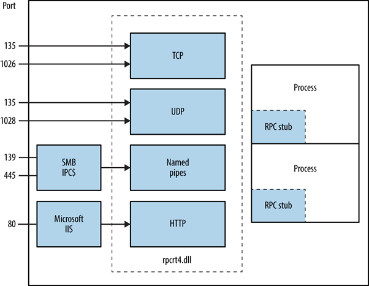

# 135, 539 - MSRPC


Este artículo es, en parte, una traducción del articulo de Hacktricks sobre MSRPC Pentesting.




## INFORMACIÓN BÁSICA

Microsoft Remote Procedure Call, Llamada a procedimiento remoto en castellano, es un protocolo que utiliza el modelo cliente-servidor para permitir a un programa solicitar servicio de otro programa en otro equipo sin necesidad de entender los detalles de la red. MSRPC se deriva de software libre pero Microsoft lo desarrollo y le puso copyright.

Dependiendo de la configuración del Host, el servicio se puede acceder por **TCP y UDP** por el puerto **135**, **vía SMB** con sesion nula o autenticada \(**TCP puerto 139 o 445**\) y **servicio web** por el puerto **TCP 593.**



### **Como funcion MSRPC?**

El proceso de MSRPC comienza en el lado del cliente con una aplicación del cliente realizando una llamada a un procedimiento que no se encuentra implementado sino que se encuentra en un programa de servidor remoto. El cliente y el servidor tienen sus propios espacios de direcciones; es decir, cada uno tiene su propio recurso de memoria asignado a los datos utilizados por el procedimiento. 


Como se muestra en la ilustración, la aplicación cliente llama a un procedimiento de código auxiliar local en lugar del código real que implementa el procedimiento. Los códigos auxiliares se compilan y vinculan con la aplicación cliente. En lugar de contener el código real que implementa el procedimiento remoto, el código auxiliar de cliente:

* Recupera los parámetros necesarios del espacio de direcciones del cliente.
* Convierte los parámetros según sea necesario en un formato JPEG estándar para la transmisión a través de la red.
* Llama a funciones de la biblioteca en tiempo de ejecución del cliente RPC para enviar la solicitud y sus parámetros al servidor.

El servidor realiza los pasos siguientes para llamar al procedimiento remoto.

1. Las funciones de la biblioteca en tiempo de ejecución RPC del servidor aceptan la solicitud y llaman al procedimiento de código auxiliar del servidor.
2. El código auxiliar del servidor recupera los parámetros del búfer de red y los convierte del formato de transmisión de red al formato que necesita el servidor.
3. El código auxiliar del servidor llama al procedimiento real en el servidor.

A continuación, se ejecuta el procedimiento remoto, posiblemente generando parámetros de salida y un valor devuelto. Una vez completado el procedimiento remoto, una secuencia similar de pasos devuelve los datos al cliente.

1. El procedimiento remoto devuelve sus datos al código auxiliar del servidor.
2. El código auxiliar del servidor convierte los parámetros de salida al formato necesario para la transmisión a través de la red y los devuelve a las funciones de biblioteca en tiempo de ejecución de RPC.
3. Las funciones de la biblioteca en tiempo de ejecución RPC del servidor transmiten los datos de la red al equipo cliente.

El cliente completa el proceso aceptando los datos a través de la red y devolviendo los datos a la función que realiza la llamada.

1. La biblioteca en tiempo de ejecución RPC de cliente recibe los valores devueltos del procedimiento remoto y los devuelve al código auxiliar del cliente.
2. El código auxiliar de cliente convierte los datos de su CONVERT al formato utilizado por el equipo cliente. El código auxiliar escribe datos en la memoria del cliente y devuelve el resultado al programa que realiza la llamada en el cliente.
3. El procedimiento de llamada continúa como si se hubiera llamado al procedimiento en el mismo equipo.

Las bibliotecas en tiempo de ejecución se proporcionan en dos partes: una biblioteca de importación, que está vinculada a la aplicación y la biblioteca en tiempo de ejecución RPC, que se implementa como una biblioteca de vínculos dinámicos \(DLL\).

La aplicación de servidor contiene llamadas a las funciones de biblioteca en tiempo de ejecución del servidor que registran la interfaz del servidor y permiten al servidor aceptar llamadas a procedimiento remoto. La aplicación de servidor también contiene los procedimientos remotos específicos de la aplicación a los que llaman las aplicaciones cliente.

## ENUMERACIÓN MSRPC

### Identificando Servicios RPC expuestos

Se puede realizar busquedas de servicios localizadores RPC y los RPC "endpoints" para catalogar servicios interesantes corriendo sobre TCP, UDP, HTTP y SMB \(utilizando las "named pipes"\). Cada valor **IFID** recuperado con este proceso es un **servicio RPC**.

**RPCDump** es perfecto para esta tarea. Su sintaxis es como sigue:

`D:\rpctools> rpcdump [-p port] 192.168.189.1`

```bash
#RESPONSE  
IfId: 5a7b91f8-ff00-11d0-a9b2-00c04fb6e6fc version 1.0  
Annotation: Messenger Service  
UUID: 00000000-0000-0000-0000-000000000000  
Binding: ncadg_ip_udp:192.168.189.1[1028]
```

Se puede acceder al RPC locator service utilizando estas 4 secuencias:

• ncacn\_ip\_tcp and ncadg\_ip\_udp \(TCP and UDP port 135\)  
• ncacn\_np \(the \pipe\epmapper named pipe via SMB\)  
• ncacn\_http \(RPC over HTTP via TCP port 80, 593, and others\)

## REFERENCIAS

[https://docs.microsoft.com/es-es/windows/win32/rpc/how-rpc-works](https://docs.microsoft.com/es-es/windows/win32/rpc/how-rpc-works)  


