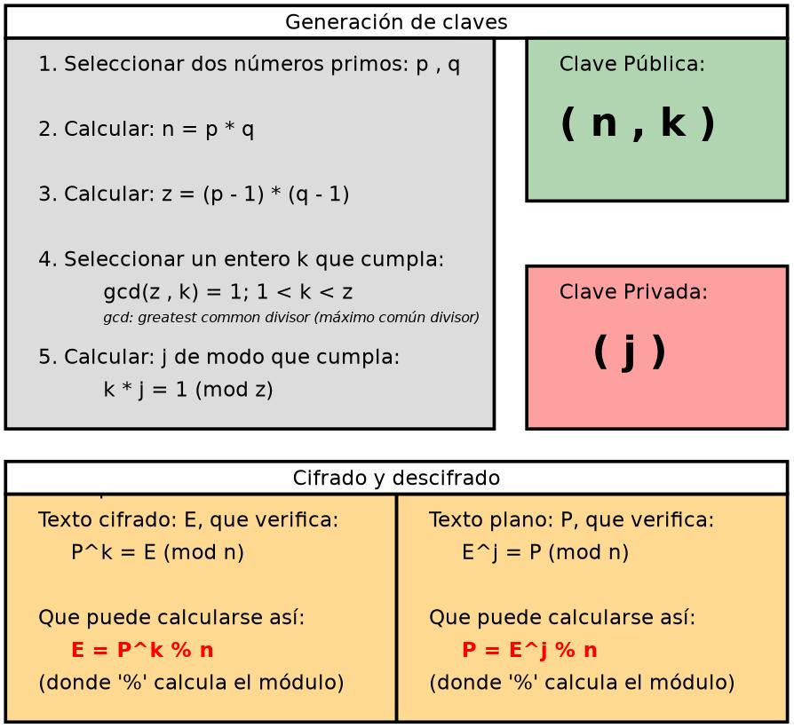

# CLAVES RSA DÉBILES

## INFORMACIÓN BÁSICA


Fuente


### Introducción

El nombre RSA proviene de las iniciales de sus tres creadores, [Rivest](https://en.wikipedia.org/wiki/Ron\_Rivest), [Shamir](https://en.wikipedia.org/wiki/Adi\_Shamir) y [Adleman](https://en.wikipedia.org/wiki/Leonard\_Adleman), allá por 1997. Se trata de un algoritmo de cifrado asimétrico, o de clave pública, y es uno de los más utilizados en la actualidad. De hecho, la mayor parte de los sitios web hoy integran seguridad SSL/TLS, y permiten la autenticación mediante RSA.

RSA, al ser un cifrador asimétrico, trabaja con dos claves, una pública y una privada. Todo el contenido de texto plano, o contenido sin cifrar, que se haya encriptado con la clave pública, podrá ser descifrado mediante la clave privada, y viceversa, todo contenido cifrado con la clave privada podrá ser descifrado mediante la clave pública.

### Como se generan claves RSA



1. Se eligen dos números primos, por ejemplo, **p=3** y **q=11**
2. Calcula el producto **`n=p*q`**, en este caso, **n=3\*11=33**
3. Calcula ** `z=(p-1)*(q-1)`**, en nuestro caso: **z=( 3 – 1 ) \* ( 11 – 1 ) = 20**
4. Elige un número primo **`k`**, tal que k sea **coprimo** a z, es decir, que k y z no tengan ningún divisor común más que el 1. Tenemos varias opciones en este ejemplo, los valores de k pueden ser 3, 7, 11, 13, 17 o 19. 5 es primo, pero no es coprimo de z puesto que 20 (z) 5 (k) son divisibles por 5.\
   Elijamos a **k=7**, por ejemplo, para simplificarnos los cálculos con un número pequeño.
5. La **clave pública** va a ser el conjunto de los números ** `(n,k)`**, es decir, _(33,7)_ en nuestro ejemplo.
6. Ahora se calcula la **clave privada**. Para ello, se elige un **número j** que verifique la siguiente ecuación (congruencia lineal):\
   **`k*j=1 (mod z)`**\
   En este caso:\
   _`7*j=1 (mod 20)`_, es decir, un valor que verifique que\
   _`7*j)/20`_` ``` sea una división con resto «**1**«.\
   Esta ecuación de congruencia tiene infinitos resultados. Para trabajar con números chicos en este ejemplo, podríamos decir que `21/20` nos devuelve «_algo_» con resto 1, por lo que, para este caso particular, `(7*j) = 21`, de modo que **j=3**. Esta es la **clave privada**.

### Cifrar un mensaje


Suponiendo que tenemos un mensaje en texto plano (sin cifrar) denotado por **P**, vamos a cifrarlo utilizando esta ecuación matemática:

**`P^k = E ( mod n )`**

Donde:

* P es el **mensaje** en texto plano
* **n y k** son la clave pública
* E es el mensaje **cifrado**

Sustituyendo los valores:

`14⁷ = E (mod 33)`

Así, elevamos 14 a la potencia de 7, y luego lo dividimos por 33 y calculamos el resto entero. Calculamos la potencia:

`14⁷ = 105413504`

Ahora dividimos por 33 (n)

`105413504 / 33 = 3194348.606`

Calculamos el resto entero (nótese el redondeo de decimales)

`3194348.606 - 3194348 = 0.606`\
`0.606 * 33 = 19.998 ~ 20`

Por lo tanto, **E=20,** que es el texto cifrado!

Esto significa que si nuestro mensaje original era el número **14**, vamos a enviarle al destinatario el número **20**, que es el número 14 cifrado con RSA utilizando la clave pública del destinatario. Cualquier intermediario que «vea» pasar el 20 no podrá obtener, en un tiempo útil (por lo menos hasta ahora) el valor 14 solo disponiendo del 20 y de la clave pública del destinatario.

Puede calcularse de manera más sencilla el texto cifrado utilizando la siguiente ecuación equivalente:

```
E = P^k mod n
```

Así, sustituyendo, y suponiendo que en la calculadora que usemos, el módulo se calcule con el operador %, tenemos:

```
E = (14^7) % 33 = 20
```

### Descifrar un mensaje


Ahora, suponiendo que el destinatario, que sí posee su **clave privada**, recibe el mensaje cifrado **E=20**, ¿cómo hace para obtener el mensaje original? Recordemos que el destinatario tiene a su **clave privada j**, que en nuestro ejemplo, vale **j=3**.

Realizamos esta operación matemática:

**`E^j = P (mod n)`**

Esta es la operación de _descifrado_, donde:

* **E** es el mensaje cifrado
* **j** la clave privada
* **P** el mensaje en texto plano
* **n** es parte de la clave pública del destinatario.

Sustituimos los valores:

`20³ = P (mod 33)`

Calculando:

`20³ = 8000`

O sea que hay un valor que resulta de dividir a 8000 por 33 (n) y que devuelva P como resto entero de la división. Veamos:

`8000/33 = ?` con resto P, de modo que calculemos este resto:

`8000/33 = 242,242242...`

El resultado entero del cociente es:

`242*33 = 7986`

Por lo que el resto, P, o el mensaje original en texto plano, será

`8000-7986 = 14 = P`

Al igual que en el caso anterior, puede calcularse nuevamente el texto plano con la siguiente ecuación equivalente:

```
P = E^j mod n
```

Sustituyendo y verificando:

```
P = 20^3 % 33 = 14
```

## EXPLOIT EN PYTHON

Ahora que sabemos cómo funciona el cifrado podemos automatizar el proceso de **intentar obtener una clave privada a partir de una clave pública demasiado débil**.


Private Key Generator

